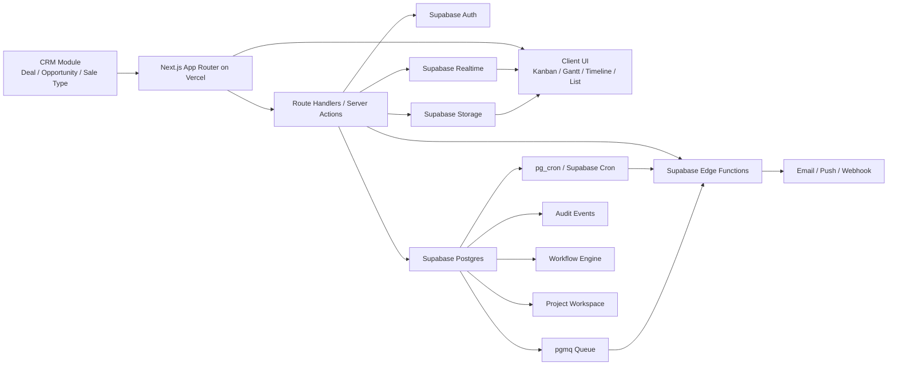
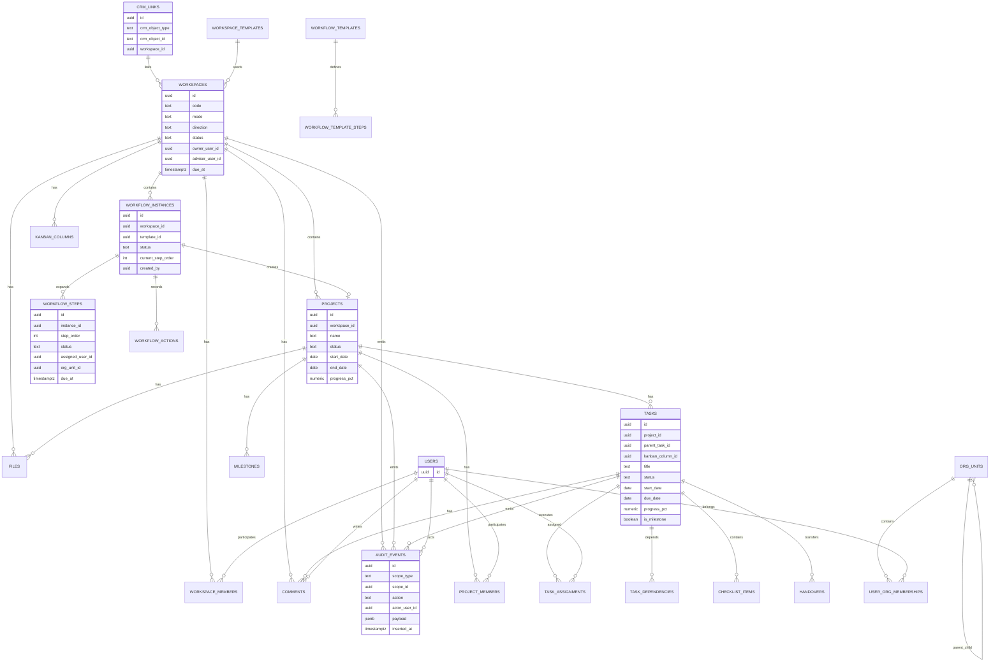
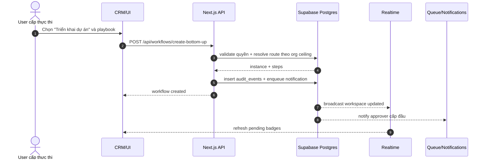
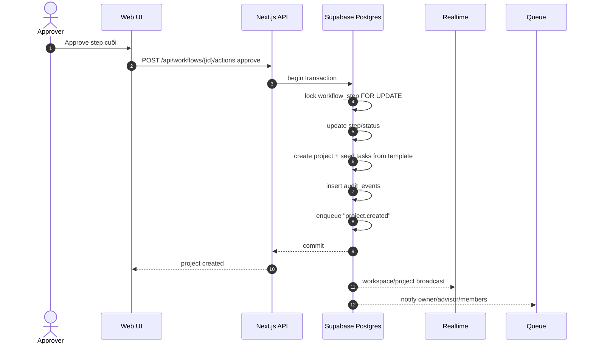
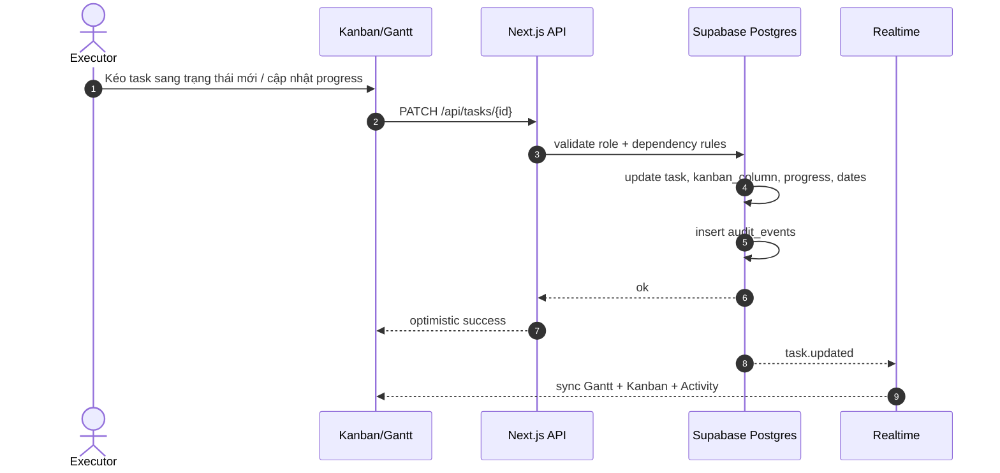
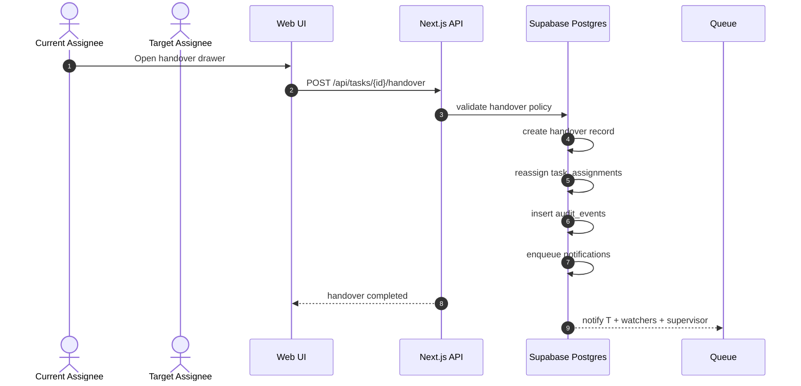
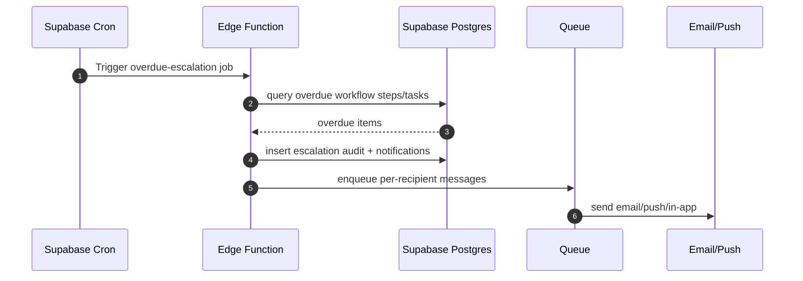
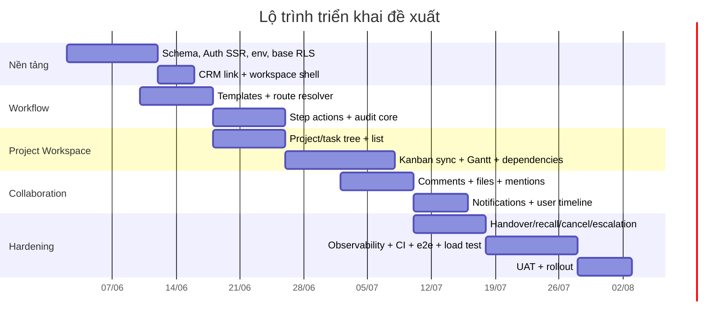

# README triển khai Workflow Governance và Project Workspace cho CRM trên Vercel và Supabase

## Tóm tắt điều hành

Tài liệu này mô tả một kiến trúc triển khai hoàn chỉnh cho module **Workflow Governance + Project Workspace** tích hợp vào CRM hiện hữu, với mục tiêu phục vụ hai nhóm nhu cầu cùng lúc: **job nhỏ xử lý bằng Kanban đơn giản** và **dự án B2B nhiều cấp tham gia, nhiều bước phê duyệt, nhiều timeline phụ thuộc, cần audit và cảnh báo hạn**. Kiến trúc đề xuất dùng **Next.js App Router triển khai trên Vercel** cho webapp và API đồng bộ, kết hợp **Supabase** cho Auth, Postgres, RLS, Realtime, Storage, Edge Functions, Cron, Queues và các tính năng vận hành dữ liệu. Mô hình này phù hợp với cách Supabase khuyến nghị cho SSR bằng `@supabase/ssr`, cookie-based session, PKCE, publishable key ở client và secret key ở server; đồng thời phù hợp với Vercel Functions/Fluid Compute cho tải web app nhiều I/O và khả năng scale linh hoạt. citeturn19view4turn19view5turn22view2turn22view3

Khuyến nghị cốt lõi là **không xây hai hệ thống riêng** cho Kanban và Gantt, mà xây một **mô hình dữ liệu thống nhất theo “Workspace”**. Một Workspace có thể chạy ở chế độ **`simple_kanban`** cho luồng cơ sở, hoặc **`project_workspace`** cho dự án có cây công việc, dependencies, gantt, timeline theo người dùng, approval, handover và escalation. Nhờ đó, CRM chỉ cần một điểm kích hoạt: khi deal/sale type là “triển khai dự án”, CRM tạo Workspace và chọn playbook tương ứng; nếu deal nhỏ thì khởi tạo board Kanban đơn giản, nếu deal phức tạp thì khởi tạo workflow governance dẫn tới project workspace. Đây là cách giảm trùng lặp UI, API, permission và audit trail.

Về realtime, kiến trúc mặc định nên dùng **Supabase Realtime Broadcast** cho các cập nhật UI quan trọng như thay đổi task, comment, approval badge, presence và indicator trên Gantt/Kanban, vì chính Supabase khuyến nghị Broadcast là lựa chọn **tốt hơn về khả năng scale và bảo mật** so với Postgres Changes; Postgres Changes đơn giản hơn nhưng không scale tốt bằng, và ở quy mô lớn còn có bottleneck do phải kiểm RLS theo subscriber và xử lý theo một luồng để giữ thứ tự thay đổi. Benchmark chính thức của Supabase cho Broadcast cho thấy năng lực rất cao trong môi trường benchmark của họ, trong khi chính tài liệu Realtime cảnh báo Postgres Changes cần cân nhắc kỹ ở quy mô lớn. citeturn8view0turn25view0turn25view1

Về hạ tầng, nếu người dùng chủ yếu ở Việt Nam và Đông Nam Á, nên đặt **Supabase ở APAC Southeast Asia Singapore** và cấu hình **Vercel Functions region về `sin1`** thay vì để mặc định `iad1`, vì Supabase khuyến nghị chọn region gần user nhất và Vercel mặc định function region cho project mới là Washington D.C. nếu không override. Với mô hình app-web + DB gần nhau, độ trễ giữa app và Postgres giảm đáng kể hơn so với để app ở region mặc định xa DB. citeturn29view0turn30search1

Về an toàn dữ liệu, đề xuất lấy **Supabase Auth + custom JWT claims + RLS** làm xương sống của authorization. Supabase hỗ trợ thêm claim vào access token bằng **Custom Access Token Hook**, và tài liệu RBAC chính thức của họ khuyến nghị dùng hook này để đẩy `user_role` hoặc claim ứng dụng vào JWT rồi tiêu thụ trong policy SQL. Đồng thời, Supabase cũng nhấn mạnh mọi schema expose qua Data API đều phải bật RLS; với function thì phải giới hạn `EXECUTE`, còn với client SSR thì dùng `createBrowserClient`/`createServerClient` để bảo toàn session theo cookie. citeturn19view0turn19view1turn10search8turn26view0turn31view0

Nếu triển khai đúng theo tài liệu này, bạn sẽ có một module có thể đi từ **khởi tạo bottom-up từ cấp user thấp nhất**, hoặc **top-down từ cấp chỉ đạo**, hoặc **hybrid**; có **simple Kanban** cho job nhẹ; có **Project Workspace** với **Gantt/Timeline/Kanban/List** cho dự án nặng; có **approval/action engine**, **handover/recall/cancel**, **audit bất biến**, **notification gần đến hạn/quá hạn**, **template/playbook**, **comment thread trên từng item timeline**, **timeline theo user**, và một lộ trình mở rộng an toàn từ khoảng **60 người dùng đến 5.000 người dùng** trên cùng nền Vercel + Supabase. citeturn6search0turn24search1turn33view0turn8view3

### Quyết định kiến trúc chính

| Quyết định | Khuyến nghị | Lý do |
|---|---|---|
| Kiểu sản phẩm | Một module `workspace` thống nhất | Giảm tách đôi Kanban và Project |
| Chế độ chạy | `simple_kanban` và `project_workspace` | Hỗ trợ job nhỏ và dự án phức tạp |
| Workflow direction | `bottom_up`, `top_down`, `hybrid` | Phù hợp thực tế nhiều cấp phê duyệt |
| Giao tiếp realtime | Broadcast private channels | Scale/bảo mật tốt hơn Postgres Changes |
| Giao dịch nghiệp vụ | Route Handlers + SQL RPC transaction | Tránh partial update/race condition |
| Background jobs | `pgmq + Supabase Cron + Edge Functions` mặc định | Gần dữ liệu, ít phụ thuộc ngoài |
| Tệp đính kèm | Supabase Storage private buckets | RLS-native, sát mô hình permission |
| Auth/permission | Supabase Auth + JWT claims + RLS | Quyền nằm ở DB, không chỉ ở UI |
| Region mặc định | Supabase Singapore + Vercel `sin1` | Giảm latency cho Việt Nam/SEA |

Các năng lực được bảng này dựa trên tài liệu chính thức về Realtime, SSR/Auth, region và các thành phần nền tảng của Vercel/Supabase. citeturn8view0turn19view4turn29view0turn30search1

## Mục tiêu, phạm vi và nguyên tắc thiết kế

### Mục tiêu nghiệp vụ

Module cần giải quyết đồng thời các yêu cầu sau:

| Nhóm mục tiêu | Yêu cầu |
|---|---|
| Workflow governance | Tạo luồng bottom-up, top-down, hybrid; route theo cấp duyệt; approve/reject/return/recall/cancel |
| Project workspace | Tạo dự án sau phê duyệt; quản lý phase, milestone, task, dependency, deadline, owner, advisor |
| Task execution | Giao việc, checklist, comment, mention, đính kèm, tiến độ người thực thi, timeline user |
| Kanban | Có board đơn giản cho job nhỏ; có Kanban đồng bộ với project task cho dự án |
| Monitoring | Cảnh báo gần đến hạn, quá hạn, SLA, escalation |
| Audit | Nhật ký hành động bất biến, truy vết ai làm gì, khi nào, từ trạng thái nào sang đâu |
| Handover | Bàn giao công việc/luồng xử lý, thu hồi luồng, đóng luồng, đẩy luồng lên cấp trên |
| Reuse | Template/playbook cho loại dự án, loại quy trình, loại board |

### Phạm vi chức năng

**Trong phạm vi**

| Chủ đề | Có trong thiết kế |
|---|---|
| CRM integration | Khởi tạo workspace từ deal/opportunity/order triển khai |
| Workflow engine | Route nhiều cấp, SLA, escalation, recall, cancel, reassign |
| Project views | Gantt, Timeline, Kanban, List, Calendar, Activity |
| Collaboration | Comments, mentions, files, user timeline, watchers |
| Security | Auth, RBAC, RLS, immutable audit, private files |
| Ops | Observability, metrics, alerts, backup/restore, runbook |
| Delivery | README, ERD, sequence, SQL, API, snippets, roadmap |

**Ngoài phạm vi của phiên bản đầu**

| Chủ đề | Ghi chú |
|---|---|
| ERP resource planning | Không làm capacity planning kiểu ERP nâng cao ở MVP |
| Portfolio analytics rất nặng | Để pha sau hoặc tách read replica/reporting |
| AI copilot | Có thể thêm sau qua pgvector hoặc external service |
| Native mobile offline-first | Chưa phải mục tiêu của tài liệu này |

### Mô hình vận hành được khuyến nghị

Mô hình đề xuất là **một lớp governance nằm trước project**, nhưng có thể “bẻ lái” linh hoạt theo ngữ cảnh nghiệp vụ:

| Kiểu khởi tạo | Luồng | Kết quả |
|---|---|---|
| Bottom-up | User thấp nhất tạo đề xuất, chọn trần duyệt | Sau phê duyệt cuối cùng tạo project workspace |
| Top-down | Lãnh đạo tạo directive / chiến dịch / chương trình | Tạo project hoặc sub-workspace xuống chi nhánh |
| Hybrid | Cấp trên tạo khung, cấp dưới bổ sung, rồi đẩy lên duyệt | Phù hợp B2B nhiều tầng phối hợp |

Đây là quyết định sản phẩm, không phải ràng buộc nền tảng. Supabase cho phép hiện thực quyền và điều kiện truy cập ở DB bằng custom claims + RLS, còn Vercel/Next.js cung cấp lớp API phù hợp để hiện thực transaction nghiệp vụ và UI SSR. citeturn19view1turn31view0turn26view1

### Nguyên tắc kiến trúc

Nguyên tắc cốt lõi của thiết kế là:

| Nguyên tắc | Mô tả |
|---|---|
| Một nguồn sự thật | Trạng thái workflow, project, task nằm ở Postgres |
| Quyền ở DB trước | UI chỉ ẩn/hiện; quyền thật quyết định bằng RLS/RPC |
| Mutation phức tạp phải atomic | Dùng transaction SQL/RPC hoặc một API handler có khóa dòng |
| Realtime là projection | Realtime chỉ đẩy sự kiện UI; không thay thế source of truth |
| Event-driven cho side effects | Notification, email, cron scan, sync ngoài không chặn request chính |
| Kanban là một view | Không xây riêng một hệ task thứ hai cho project mode |
| Audit bất biến | Không update/delete business audit; chỉ append |

### Mục tiêu phi chức năng

| Thuộc tính | Mục tiêu đề xuất |
|---|---|
| Availability | 99.9% cho API và thao tác chính |
| P95 read API | dưới 400 ms cho query phổ biến |
| P95 write action | dưới 800 ms cho approve/move task/handover |
| P95 initial project load | dưới 2.5 giây cho workspace dưới 2.000 task |
| Notification lag | dưới 2 phút cho due-soon/overdue |
| Audit completeness | 100% mutation nghiệp vụ quan trọng phải sinh audit record |
| Security posture | RLS cho mọi bảng expose; private bucket cho file nhạy cảm |

Các con số trên là mục tiêu nội bộ để thiết kế và theo dõi SLO; không phải giới hạn cứng của nền tảng.

## Kiến trúc hệ thống

### Thành phần hệ thống

Kiến trúc logic khuyến nghị:



**Phân vai thành phần**

| Thành phần | Vai trò chính | Ghi chú triển khai |
|---|---|---|
| CRM module hiện hữu | Chọn “triển khai dự án”, tạo link sang workspace | Không nhúng quá nhiều logic workflow trong CRM |
| Next.js trên Vercel | UI SSR/CSR, API sync, orchestration nhẹ | Dùng App Router, Route Handlers |
| Supabase Auth | Session, user identity, claims | SSR bằng cookie với `@supabase/ssr` |
| Supabase Postgres | Source of truth | Workflow, project, task, audit, notification state |
| Supabase Realtime | Update UI theo thời gian thực | Broadcast riêng tư theo workspace/task/user |
| Supabase Storage | File attachments | Private bucket + RLS |
| Supabase Edge Functions | Worker gần dữ liệu, webhook, notification executor | Hợp với cron/queue/webhook |
| `pgmq` | Queue nội bộ | Durable, archival, low-ops |
| `pg_cron` / Supabase Cron | Job định kỳ | Scan due soon, overdue, SLA |
| Email/Push service | Kênh thông báo ngoài | Resend/FCM/OneSignal tùy nhu cầu |

Supabase Edge Functions được thiết kế cho TypeScript chạy phân tán ở edge, phù hợp webhook và tích hợp third-party, còn Vercel Functions phù hợp lớp web app/API và hỗ trợ Fluid Compute với optimized concurrency và `waitUntil()` cho tác vụ không chặn response. Supabase Cron chạy trên `pg_cron`; job và lần chạy được lưu trong `cron.job` và `cron.job_run_details`. Queue `pgmq` là queue Postgres-native, hỗ trợ delivery-with-visibility-timeout và archival. citeturn19view3turn22view3turn23search1turn21search7turn21search3

### Dòng dữ liệu đề xuất

Luồng dữ liệu nên tách thành ba lớp:

| Lớp | Cơ chế | Ví dụ |
|---|---|---|
| Read path | SSR + client query qua Supabase | load project, task tree, comments |
| Write path | API route / RPC transaction | create workflow, approve, handover, move task |
| Side effect path | Queue + cron + Edge Function | email, push, escalation, sync hệ khác |

Cách chia này giúp mutation chính không bị kéo dài bởi email/push/webhook ngoài, đồng thời giữ trạng thái chính trong DB. Vercel cho phép dùng `waitUntil()` hoặc Next.js `after()` cho side effect ngắn như log/cache invalidation sau response, còn job dài hoặc fan-out nhiều người nhận nên đẩy sang queue/cron/worker để tránh giữ request quá lâu. citeturn23search1turn23search0turn22view2

### Sơ đồ thực thể



### Luồng phổ biến

#### Tạo workflow bottom-up



#### Phê duyệt để tạo project



#### Vòng đời task



#### Bàn giao



#### Escalation



### Chế độ Kanban đơn giản và Project Workspace

Đề xuất **không** xây hai mô hình task khác nhau. Cùng một bảng `tasks`, nhưng:

| Chế độ | Đặc điểm |
|---|---|
| `simple_kanban` | Task phẳng, ít/không dependency, ít metadata, board first |
| `project_workspace` | Task có cây cha-con, dates, dependencies, milestone, workload, multi-view |

Điều này cho phép một job nhỏ ban đầu sống như Kanban đơn giản, sau đó “nâng cấp” thành project workspace mà không migrate dữ liệu sang hệ khác. Trong UI, bạn chỉ đổi cách render và giới hạn field, không đổi storage model.

### Cơ chế realtime khuyến nghị

Thiết kế realtime nên theo quy tắc sau:

| Loại dữ liệu | Cơ chế khuyên dùng | Lý do |
|---|---|---|
| Presence, typing, badge, comment count | Realtime Broadcast | nhẹ, private channel, scale tốt |
| Updated task/project cards | Broadcast từ API hoặc DB trigger | phản hồi UI nhanh |
| Admin low-volume audit monitor | Postgres Changes | đơn giản hơn cho backoffice |
| High-volume table sync | Tránh Postgres Changes trực tiếp | dễ bottleneck ở scale lớn |

Supabase ghi rõ Broadcast là phương thức **được khuyến nghị** cho khả năng mở rộng và bảo mật; Postgres Changes đơn giản hơn nhưng “does not scale as well”. Tài liệu benchmark cũng cho thấy Postgres Changes chịu chi phí kiểm quyền theo subscriber và xử lý theo một luồng để duy trì thứ tự. citeturn8view0turn25view0

## Mô hình dữ liệu, RLS và API

### Schema và naming convention

Khuyến nghị dùng các schema sau:

| Schema | Mục đích | Expose API |
|---|---|---|
| `wg` | Bảng nghiệp vụ chính của module | Có, nhưng phải bật RLS toàn bộ |
| `wg_private` | Helper functions, security definer, internal utilities | Không expose |
| `audit` | Tùy chọn tách audit bất biến | Có thể không expose |
| `public` | Tránh đặt bảng nghiệp vụ mới ở đây nếu có thể | Chỉ giữ phần legacy |
| `storage` | Hệ storage Supabase | dùng qua policy |

Supabase khuyến nghị dùng **dedicated API schema** để bề mặt Data API dễ hiểu và dễ khóa hơn, thay vì dồn hết vào `public`. Đồng thời, mọi bảng/views trong schema expose đều cần RLS. Với function, phải quản lý `EXECUTE` thay vì trông chờ RLS. citeturn26view1turn10search0turn10search8turn26view0

### Bảng cốt lõi

| Bảng | Ý nghĩa |
|---|---|
| `wg.org_units` | Cây tổ chức, chi nhánh, cấp hệ thống |
| `wg.user_org_memberships` | User thuộc đơn vị nào, cấp gì |
| `wg.workspace_templates` | Playbook/template ở mức workspace |
| `wg.workflow_templates` | Template route phê duyệt |
| `wg.workflow_template_steps` | Các bước định nghĩa của route |
| `wg.workspaces` | Container chung cho Kanban/Project/Workflow |
| `wg.workspace_members` | Thành viên, role, scope trong workspace |
| `wg.workflow_instances` | Phiên bản workflow đang chạy |
| `wg.workflow_steps` | Các bước thực thi thực tế |
| `wg.workflow_actions` | approve/reject/return/recall/cancel/escalate |
| `wg.projects` | Project sinh ra sau phê duyệt hoặc tạo trực tiếp |
| `wg.project_members` | Thành viên dự án |
| `wg.kanban_columns` | Cột Kanban theo workspace |
| `wg.tasks` | Task dùng chung cho Gantt/Timeline/Kanban |
| `wg.task_dependencies` | Quan hệ predecessor/successor |
| `wg.task_assignments` | Giao việc cho user |
| `wg.checklist_items` | To-do con của task |
| `wg.comments` | Comment thread đa hình theo scope |
| `wg.files` | Metadata file đính kèm |
| `wg.notifications` | Notification state |
| `wg.handovers` | Bản ghi bàn giao |
| `wg.audit_events` | Nhật ký nghiệp vụ append-only |
| `wg.crm_links` | Liên kết thực thể CRM và workspace |

### Sample SQL DDL

Đây là bộ DDL mẫu để khởi tạo lõi hệ thống. Trong triển khai thật, bạn nên tách migration nhỏ theo pha và thêm test pgTAP cho từng migration. Supabase CLI hỗ trợ local stack, migration files, reset local DB và test DB bằng pgTAP. citeturn18search2turn18search6turn18search10turn18search19

```sql
create schema if not exists wg;
create schema if not exists wg_private;

create extension if not exists pgcrypto;
create extension if not exists pg_trgm;

create type wg.workspace_mode as enum ('simple_kanban', 'project_workspace');
create type wg.workflow_direction as enum ('bottom_up', 'top_down', 'hybrid');
create type wg.workflow_status as enum ('draft', 'pending', 'approved', 'rejected', 'returned', 'cancelled', 'completed');
create type wg.task_status as enum ('todo', 'in_progress', 'blocked', 'review', 'done', 'cancelled');
create type wg.member_role as enum (
  'executor',
  'branch_supervisor',
  'branch_leader',
  'system_officer_l1',
  'system_leader_l1',
  'approver_high',
  'owner',
  'advisor',
  'watcher'
);

create table if not exists wg.org_units (
  id uuid primary key default gen_random_uuid(),
  parent_id uuid references wg.org_units(id) on delete restrict,
  code text not null unique,
  name text not null,
  unit_type text not null,
  hierarchy_level int not null,
  created_at timestamptz not null default now()
);

create table if not exists wg.user_org_memberships (
  id uuid primary key default gen_random_uuid(),
  user_id uuid not null references auth.users(id) on delete cascade,
  org_unit_id uuid not null references wg.org_units(id) on delete cascade,
  title text,
  hierarchy_level int not null,
  is_primary boolean not null default false,
  manager_user_id uuid references auth.users(id),
  created_at timestamptz not null default now(),
  unique (user_id, org_unit_id)
);

create table if not exists wg.workspace_templates (
  id uuid primary key default gen_random_uuid(),
  code text not null unique,
  name text not null,
  mode wg.workspace_mode not null,
  default_direction wg.workflow_direction not null,
  config jsonb not null default '{}'::jsonb,
  is_active boolean not null default true,
  created_by uuid references auth.users(id),
  created_at timestamptz not null default now()
);

create table if not exists wg.workspaces (
  id uuid primary key default gen_random_uuid(),
  code text not null unique,
  name text not null,
  mode wg.workspace_mode not null,
  direction wg.workflow_direction not null,
  status text not null default 'active',
  template_id uuid references wg.workspace_templates(id),
  owner_user_id uuid references auth.users(id),
  advisor_user_id uuid references auth.users(id),
  crm_object_type text,
  crm_object_id text,
  org_unit_id uuid references wg.org_units(id),
  planned_start_at timestamptz,
  planned_due_at timestamptz,
  actual_end_at timestamptz,
  metadata jsonb not null default '{}'::jsonb,
  created_by uuid not null references auth.users(id),
  created_at timestamptz not null default now(),
  updated_at timestamptz not null default now()
);

create table if not exists wg.workspace_members (
  id uuid primary key default gen_random_uuid(),
  workspace_id uuid not null references wg.workspaces(id) on delete cascade,
  user_id uuid not null references auth.users(id) on delete cascade,
  role wg.member_role not null,
  permissions jsonb not null default '{}'::jsonb,
  joined_at timestamptz not null default now(),
  unique (workspace_id, user_id, role)
);

create table if not exists wg.workflow_templates (
  id uuid primary key default gen_random_uuid(),
  workspace_template_id uuid references wg.workspace_templates(id) on delete cascade,
  code text not null unique,
  name text not null,
  config jsonb not null default '{}'::jsonb,
  created_at timestamptz not null default now()
);

create table if not exists wg.workflow_template_steps (
  id uuid primary key default gen_random_uuid(),
  template_id uuid not null references wg.workflow_templates(id) on delete cascade,
  step_order int not null,
  name text not null,
  assignee_strategy text not null, -- direct_manager, org_role, explicit_user, dynamic_sql
  required_role wg.member_role,
  sla_hours int,
  action_rules jsonb not null default '{}'::jsonb,
  unique (template_id, step_order)
);

create table if not exists wg.workflow_instances (
  id uuid primary key default gen_random_uuid(),
  workspace_id uuid not null references wg.workspaces(id) on delete cascade,
  template_id uuid not null references wg.workflow_templates(id),
  status wg.workflow_status not null default 'pending',
  current_step_order int,
  requested_ceiling_level int,
  requested_by uuid not null references auth.users(id),
  submitted_at timestamptz,
  closed_at timestamptz,
  payload jsonb not null default '{}'::jsonb,
  created_at timestamptz not null default now()
);

create table if not exists wg.workflow_steps (
  id uuid primary key default gen_random_uuid(),
  instance_id uuid not null references wg.workflow_instances(id) on delete cascade,
  step_order int not null,
  name text not null,
  status wg.workflow_status not null default 'pending',
  assigned_user_id uuid references auth.users(id),
  assigned_org_unit_id uuid references wg.org_units(id),
  due_at timestamptz,
  acted_at timestamptz,
  acted_by uuid references auth.users(id),
  action_comment text,
  payload jsonb not null default '{}'::jsonb,
  unique (instance_id, step_order)
);

create table if not exists wg.projects (
  id uuid primary key default gen_random_uuid(),
  workspace_id uuid not null unique references wg.workspaces(id) on delete cascade,
  workflow_instance_id uuid references wg.workflow_instances(id),
  name text not null,
  status text not null default 'initiating',
  project_owner_id uuid references auth.users(id),
  advisor_user_id uuid references auth.users(id),
  start_date date,
  due_date date,
  completed_at timestamptz,
  progress_pct numeric(5,2) not null default 0,
  settings jsonb not null default '{}'::jsonb,
  created_at timestamptz not null default now(),
  updated_at timestamptz not null default now()
);

create table if not exists wg.kanban_columns (
  id uuid primary key default gen_random_uuid(),
  workspace_id uuid not null references wg.workspaces(id) on delete cascade,
  code text not null,
  name text not null,
  wip_limit int,
  sort_order int not null,
  is_done boolean not null default false,
  unique (workspace_id, code),
  unique (workspace_id, sort_order)
);

create table if not exists wg.tasks (
  id uuid primary key default gen_random_uuid(),
  project_id uuid not null references wg.projects(id) on delete cascade,
  parent_task_id uuid references wg.tasks(id) on delete cascade,
  kanban_column_id uuid references wg.kanban_columns(id),
  title text not null,
  description jsonb not null default '{}'::jsonb,
  status wg.task_status not null default 'todo',
  priority smallint not null default 3,
  depth int not null default 0,
  sort_order int not null default 0,
  is_milestone boolean not null default false,
  start_date date,
  due_date date,
  baseline_start_date date,
  baseline_due_date date,
  progress_pct numeric(5,2) not null default 0,
  effort_hours numeric(10,2),
  owner_user_id uuid references auth.users(id),
  advisor_user_id uuid references auth.users(id),
  created_by uuid not null references auth.users(id),
  completed_at timestamptz,
  metadata jsonb not null default '{}'::jsonb,
  search_text tsvector generated always as (
    to_tsvector('simple',
      coalesce(title,'') || ' ' || coalesce(description::text,'')
    )
  ) stored,
  created_at timestamptz not null default now(),
  updated_at timestamptz not null default now()
);

create table if not exists wg.task_assignments (
  id uuid primary key default gen_random_uuid(),
  task_id uuid not null references wg.tasks(id) on delete cascade,
  user_id uuid not null references auth.users(id) on delete cascade,
  responsibility text not null default 'executor',
  progress_pct numeric(5,2) not null default 0,
  assigned_at timestamptz not null default now(),
  unique (task_id, user_id, responsibility)
);

create table if not exists wg.task_dependencies (
  id uuid primary key default gen_random_uuid(),
  predecessor_task_id uuid not null references wg.tasks(id) on delete cascade,
  successor_task_id uuid not null references wg.tasks(id) on delete cascade,
  dependency_type text not null default 'finish_to_start',
  lag_days int not null default 0,
  unique (predecessor_task_id, successor_task_id)
);

create table if not exists wg.checklist_items (
  id uuid primary key default gen_random_uuid(),
  task_id uuid not null references wg.tasks(id) on delete cascade,
  title text not null,
  is_done boolean not null default false,
  sort_order int not null default 0,
  assigned_user_id uuid references auth.users(id),
  completed_at timestamptz
);

create table if not exists wg.comments (
  id uuid primary key default gen_random_uuid(),
  workspace_id uuid not null references wg.workspaces(id) on delete cascade,
  scope_type text not null, -- workspace, workflow_step, project, task
  scope_id uuid not null,
  parent_comment_id uuid references wg.comments(id) on delete cascade,
  author_user_id uuid not null references auth.users(id) on delete cascade,
  body jsonb not null,
  mentions uuid[] not null default '{}',
  is_deleted boolean not null default false,
  created_at timestamptz not null default now(),
  updated_at timestamptz not null default now()
);

create table if not exists wg.files (
  id uuid primary key default gen_random_uuid(),
  workspace_id uuid not null references wg.workspaces(id) on delete cascade,
  project_id uuid references wg.projects(id) on delete cascade,
  task_id uuid references wg.tasks(id) on delete cascade,
  bucket_id text not null,
  object_path text not null,
  original_name text not null,
  mime_type text,
  size_bytes bigint,
  uploaded_by uuid not null references auth.users(id),
  created_at timestamptz not null default now()
);

create table if not exists wg.handovers (
  id uuid primary key default gen_random_uuid(),
  workspace_id uuid not null references wg.workspaces(id) on delete cascade,
  task_id uuid references wg.tasks(id) on delete cascade,
  workflow_step_id uuid references wg.workflow_steps(id) on delete cascade,
  from_user_id uuid not null references auth.users(id),
  to_user_id uuid not null references auth.users(id),
  reason text not null,
  payload jsonb not null default '{}'::jsonb,
  created_at timestamptz not null default now()
);

create table if not exists wg.notifications (
  id uuid primary key default gen_random_uuid(),
  user_id uuid not null references auth.users(id) on delete cascade,
  workspace_id uuid references wg.workspaces(id) on delete cascade,
  scope_type text not null,
  scope_id uuid,
  notification_type text not null,
  title text not null,
  body text,
  channel text not null default 'in_app',
  read_at timestamptz,
  delivered_at timestamptz,
  payload jsonb not null default '{}'::jsonb,
  created_at timestamptz not null default now()
);

create table if not exists wg.audit_events (
  id uuid primary key default gen_random_uuid(),
  workspace_id uuid not null references wg.workspaces(id) on delete cascade,
  project_id uuid references wg.projects(id) on delete cascade,
  task_id uuid references wg.tasks(id) on delete cascade,
  workflow_instance_id uuid references wg.workflow_instances(id) on delete cascade,
  scope_type text not null,
  scope_id uuid not null,
  action text not null,
  actor_user_id uuid references auth.users(id),
  payload jsonb not null default '{}'::jsonb,
  inserted_at timestamptz not null default now()
);

create index if not exists idx_workspace_members_user
  on wg.workspace_members (user_id, workspace_id);

create index if not exists idx_tasks_project_parent
  on wg.tasks (project_id, parent_task_id, sort_order);

create index if not exists idx_tasks_due_active
  on wg.tasks (project_id, due_date)
  where status not in ('done', 'cancelled');

create index if not exists idx_tasks_owner_active
  on wg.tasks (owner_user_id, due_date)
  where status not in ('done', 'cancelled');

create index if not exists idx_tasks_search
  on wg.tasks using gin (search_text);

create index if not exists idx_comments_scope
  on wg.comments (workspace_id, scope_type, scope_id, created_at);

create index if not exists idx_audit_scope_time
  on wg.audit_events (workspace_id, scope_type, scope_id, inserted_at desc);

create index if not exists idx_files_scope
  on wg.files (workspace_id, project_id, task_id);

create index if not exists idx_notifications_user_unread
  on wg.notifications (user_id, read_at, created_at desc);
```

Thiết kế index ở trên tận dụng khuyến nghị của PostgreSQL về **partial indexes** để giảm kích thước index và tăng tốc nhóm truy vấn hay dùng trên subset “task chưa hoàn tất”, đồng thời dùng **expression/generated/search indexes** cho tìm kiếm dạng full-text. PostgreSQL cũng hỗ trợ `pg_trgm` cho similarity search/typo tolerance. citeturn26view3turn26view4turn26view5turn26view6

### Helper functions và RLS strategy

Đối với Supabase, quyền thật phải nằm ở DB. RLS sẽ dựa chủ yếu vào:

| Nguồn điều kiện | Ví dụ |
|---|---|
| `auth.uid()` | user là owner/assignee/comment author |
| membership table | user là thành viên workspace/project |
| org hierarchy | user thuộc org unit phù hợp step phê duyệt |
| JWT custom claims | `user_role`, `org_levels`, `tenant_id` |
| security definer helper | kiểm role nhanh, tránh join RLS lồng nhau gây chậm |

Supabase có hướng dẫn chính thức cho custom claims bằng access token hook, và cũng có tài liệu riêng về best practices tối ưu hiệu năng RLS: index các cột dùng trong policy, bọc `auth.uid()`/helper vào `select ...`, dùng security definer đúng cách, và không để RLS đồng thời đóng vai trò filter duy nhất cho truy vấn lớn. citeturn19view0turn19view1turn32view0

```sql
-- Revoke default function execution in exposed schema
revoke execute on all functions in schema wg from public;
revoke execute on all functions in schema wg from anon, authenticated;
alter default privileges in schema wg revoke execute on functions from public;
alter default privileges in schema wg revoke execute on functions from anon, authenticated;

create or replace function wg_private.is_workspace_member(p_workspace_id uuid)
returns boolean
language sql
security definer
stable
set search_path = wg, public
as $$
  select exists (
    select 1
    from wg.workspace_members wm
    where wm.workspace_id = p_workspace_id
      and wm.user_id = auth.uid()
  );
$$;

revoke all on function wg_private.is_workspace_member(uuid) from public;
grant execute on function wg_private.is_workspace_member(uuid) to authenticated;

create or replace function wg_private.can_manage_workspace(p_workspace_id uuid)
returns boolean
language sql
security definer
stable
set search_path = wg, public
as $$
  select exists (
    select 1
    from wg.workspace_members wm
    where wm.workspace_id = p_workspace_id
      and wm.user_id = auth.uid()
      and wm.role in ('owner','advisor','branch_supervisor','branch_leader','system_leader_l1','approver_high')
  );
$$;

revoke all on function wg_private.can_manage_workspace(uuid) from public;
grant execute on function wg_private.can_manage_workspace(uuid) to authenticated;

alter table wg.workspaces enable row level security;
alter table wg.workspace_members enable row level security;
alter table wg.projects enable row level security;
alter table wg.tasks enable row level security;
alter table wg.comments enable row level security;
alter table wg.files enable row level security;
alter table wg.notifications enable row level security;
alter table wg.audit_events enable row level security;

create policy "workspace_select_member"
on wg.workspaces
for select
to authenticated
using (
  created_by = (select auth.uid())
  or owner_user_id = (select auth.uid())
  or advisor_user_id = (select auth.uid())
  or (select wg_private.is_workspace_member(id))
);

create policy "workspace_update_manager"
on wg.workspaces
for update
to authenticated
using ((select wg_private.can_manage_workspace(id)))
with check ((select wg_private.can_manage_workspace(id)));

create policy "project_select_member"
on wg.projects
for select
to authenticated
using ((select wg_private.is_workspace_member(workspace_id)));

create policy "task_select_member"
on wg.tasks
for select
to authenticated
using (
  exists (
    select 1
    from wg.projects p
    where p.id = project_id
      and (select wg_private.is_workspace_member(p.workspace_id))
  )
);

create policy "task_update_actor"
on wg.tasks
for update
to authenticated
using (
  owner_user_id = (select auth.uid())
  or exists (
    select 1 from wg.task_assignments ta
    where ta.task_id = id and ta.user_id = (select auth.uid())
  )
  or exists (
    select 1 from wg.projects p
    where p.id = project_id
      and (select wg_private.can_manage_workspace(p.workspace_id))
  )
)
with check (true);

create policy "comment_select_member"
on wg.comments
for select
to authenticated
using ((select wg_private.is_workspace_member(workspace_id)));

create policy "comment_insert_member"
on wg.comments
for insert
to authenticated
with check (
  author_user_id = (select auth.uid())
  and (select wg_private.is_workspace_member(workspace_id))
);

create policy "notification_select_self"
on wg.notifications
for select
to authenticated
using (user_id = (select auth.uid()));

create policy "audit_select_member"
on wg.audit_events
for select
to authenticated
using ((select wg_private.is_workspace_member(workspace_id)));
```

### Audit bất biến

OWASP khuyến nghị log/audit cho giao dịch giá trị cao phải có **integrity controls** để khó sửa/xóa; Supabase cũng có `PGAudit` cho DB-level activity logging, `Auth Audit Logs` cho sự kiện xác thực, `Platform Audit Logs` cho hành động quản trị project. Tuy vậy, các log nền tảng **không thay thế** audit nghiệp vụ của bạn, nên module vẫn cần bảng `wg.audit_events` riêng, append-only và chặn `UPDATE/DELETE`. citeturn4search6turn5search14turn20view1turn20view4turn5search6

```sql
create or replace function wg_private.prevent_audit_mutation()
returns trigger
language plpgsql
as $$
begin
  raise exception 'audit_events is append-only';
end;
$$;

create trigger trg_audit_events_no_update
before update or delete on wg.audit_events
for each row
execute function wg_private.prevent_audit_mutation();
```

Nếu cần mức chống chối bỏ cao hơn, bạn có thể thêm `prev_hash` và `event_hash` theo hash-chain, rồi định kỳ đối chiếu sang kho log ngoài.

### Tệp đính kèm và storage

Khuyến nghị mặc định là **Supabase Storage private bucket**, vì Supabase Storage tích hợp trực tiếp với Postgres RLS và mặc định không cho upload nếu chưa có policy. Chính tài liệu Storage nhấn mạnh quyền được quyết định qua policy trên `storage.objects`. Với tài liệu nhạy cảm của workflow/project, không nên dùng public bucket. Supabase shared responsibility cũng nêu rõ không nên đặt dữ liệu nhạy cảm trong public Storage buckets. citeturn20view2turn31view1

Bố cục object path khuyến nghị:

```txt
workspaces/{workspace_id}/projects/{project_id}/tasks/{task_id}/{file_uuid}-{slug}
```

Nhưng quyền **không nên** chỉ suy ra từ path. Quyền nên dựa vào bảng `wg.files` + `workspace_id/project_id/task_id`, còn bucket policy chỉ là lớp cuối.

### Thiết kế API

Khuyến nghị phân loại endpoint theo domain, và dồn mọi mutation có side-effect nhiều bảng về server-side API/RPC thay vì cho client cập nhật trực tiếp nhiều table.

#### Endpoint chính

| Method | Path | Auth | Mục đích |
|---|---|---|---|
| `POST` | `/api/workspaces` | user session | Tạo workspace trực tiếp |
| `POST` | `/api/workflows/create-bottom-up` | user session | Tạo workflow bottom-up |
| `POST` | `/api/workflows/create-top-down` | user session | Tạo directive/top-down |
| `GET` | `/api/workflows/:id` | member | Lấy chi tiết workflow |
| `POST` | `/api/workflows/:id/actions` | assignee/manager | approve/reject/return/recall/cancel |
| `POST` | `/api/workflows/:id/create-project` | system/server | tạo project từ workflow |
| `GET` | `/api/projects/:id` | member | project summary + counters |
| `GET` | `/api/projects/:id/tasks` | member | tree tasks cho gantt/list |
| `POST` | `/api/projects/:id/tasks` | member quyền ghi | tạo task/phase/milestone |
| `PATCH` | `/api/tasks/:id` | assignee/manager | cập nhật task, date, progress, status |
| `POST` | `/api/tasks/:id/handover` | current assignee/manager | bàn giao |
| `POST` | `/api/tasks/:id/dependencies` | manager | thêm dependency |
| `POST` | `/api/comments` | member | comment/mention/reply |
| `POST` | `/api/files/sign-upload` | member | cấp signed upload |
| `GET` | `/api/notifications` | self | inbox user |
| `GET` | `/api/users/me/timeline` | self | timeline cá nhân |
| `POST` | `/api/templates/:id/instantiate` | manager | tạo workspace từ playbook |

#### Payload mẫu

```json
POST /api/workflows/create-bottom-up
{
  "crmObjectType": "deal",
  "crmObjectId": "DEAL_10293",
  "workspaceTemplateCode": "b2b-implementation-standard",
  "name": "Triển khai chi nhánh Đà Nẵng cho khách hàng ABC",
  "requestedCeilingLevel": 5,
  "orgUnitId": "6c4ef4c8-7d0b-4bb3-b5f0-c8b9a103dcab",
  "ownerUserId": "4eb4f91d-a42f-4e7e-b96b-4ea19be91f0e",
  "advisorUserId": "0f63c82b-4a80-48f4-9217-9cd0bcf7fdae",
  "plannedStartAt": "2026-06-10T08:00:00+07:00",
  "plannedDueAt": "2026-07-15T18:00:00+07:00",
  "payload": {
    "contractValue": 1200000000,
    "customerTier": "enterprise",
    "implementationScope": ["onboarding", "training", "handover"]
  }
}
```

```json
POST /api/workflows/{id}/actions
{
  "action": "approve",
  "stepId": "8d10ec43-e663-4f77-a8fb-8d0b4ca7a754",
  "comment": "Đồng ý triển khai, giữ SLA 30 ngày",
  "payload": {
    "approvedBudget": 150000000,
    "conditions": ["báo cáo tuần", "advisor tham gia kickoff"]
  }
}
```

```json
PATCH /api/tasks/{id}
{
  "title": "Đào tạo user chi nhánh",
  "status": "in_progress",
  "kanbanColumnCode": "doing",
  "startDate": "2026-06-15",
  "dueDate": "2026-06-20",
  "progressPct": 45,
  "ownerUserId": "4eb4f91d-a42f-4e7e-b96b-4ea19be91f0e",
  "advisorUserId": "0f63c82b-4a80-48f4-9217-9cd0bcf7fdae"
}
```

### Xác thực và quyền ở API

Với Next.js + Supabase SSR, dùng session cookie và `createServerClient()` trong Route Handlers/Server Actions. Supabase xác nhận SSR tương thích hoàn toàn, dùng cookie thay local storage, và package `@supabase/ssr` đã tối ưu cho `createBrowserClient`/`createServerClient`. Tài liệu cũng lưu ý các key mới dạng `sb_publishable_*` và `sb_secret_*`; key cũ `anon` / `service_role` vẫn hoạt động tới cuối 2026 nhưng nên chuyển dần sang khóa mới. citeturn19view4turn19view5

Khuyến nghị:

| Loại request | Cách auth |
|---|---|
| Browser -> data read | publishable key + session JWT + RLS |
| Browser -> mutation phức tạp | Route Handler dùng server client |
| Server -> DB direct | transaction pooler / dedicated pooler |
| Edge Function user scoped | `verify_jwt = true`, `auth: 'user'` |
| Webhook ngoài | HMAC signature + IP allowlist nếu có |

Supabase có hướng dẫn Edge Functions với `auth: 'user'`, theo đó `ctx.supabase` đã được scope theo RLS của caller còn `supabaseAdmin` bypass RLS. Điều này rất hữu dụng cho worker vừa cần đọc như user vừa cần gửi notification bằng quyền admin trong cùng function. citeturn19view2

### Webhooks và events

Nên chuẩn hóa event names dạng:

| Event | Khi sinh |
|---|---|
| `workflow.created` | tạo workflow |
| `workflow.step.assigned` | gán approver |
| `workflow.approved` | 1 bước approve |
| `workflow.returned` | trả về sửa |
| `project.created` | sinh project |
| `task.created` | thêm task |
| `task.updated` | cập nhật task |
| `task.handover.created` | bàn giao |
| `task.overdue` | scan quá hạn |
| `comment.created` | comment mới |
| `notification.created` | vào inbox |

Nếu cần gọi HTTP ra ngoài từ DB event, Supabase có **Database Webhooks** dựa trên `pg_net`, bất đồng bộ nên không chặn transaction lâu. Nhưng với nghiệp vụ quan trọng, nên ưu tiên **ghi outbox/queue trong cùng transaction**, còn HTTP/webhook xử lý sau ở worker để dễ retry và audit hơn. citeturn20view5

### Realtime channel naming

| Channel | Dùng cho |
|---|---|
| `workspace:{workspace_id}` | counters, member changes, notifications tổng |
| `project:{project_id}` | task tree, badges, phase changes |
| `task:{task_id}` | comment thread chi tiết, activity drawer |
| `user:{user_id}` | inbox riêng, reminder riêng |
| `presence:workspace:{workspace_id}` | ai đang xem/chỉnh |

Supabase Realtime dùng channel/topic làm nền tảng, hỗ trợ private channel và authorization riêng. Các channel này nên là private mặc định cho module này. citeturn25view2

## Giao diện, triển khai và vận hành

### Cấu trúc UI/UX đề xuất

Khuyến nghị cấu trúc màn hình theo ba lớp:

| Lớp | Màn hình |
|---|---|
| Governance | Inbox, pending approvals, workflow detail, action panel |
| Workspace | Overview, Gantt, Kanban, List, Activity, Members, Files, Audit |
| Personal | My tasks, My approvals, My timeline, Overdue, Mentions |

#### Tương tác quan trọng

| Chức năng | Hành vi UX |
|---|---|
| Kéo-thả Gantt | kéo thanh đổi date, resize duration, vẽ dependency |
| Kanban sync | kéo card đổi cột tự cập nhật `status` và Gantt |
| Comment theo item timeline | click task/milestone mở side panel thread |
| Hành động theo bước | approve/reject/return/recall/cancel ngay tại panel phải |
| Timeline user | lọc activity theo actor hoặc assignee |
| Handover | drawer có from/to/reason/checklist/handover note |
| Audit | tab read-only, filter theo action/actor/time |
| Cảnh báo hạn | badge gần hạn/quá hạn trên card/bar/list |
| Advisor/owner | avatar group hiển thị rõ người chịu trách nhiệm và người cố vấn |

### Thiết kế view cho hai chế độ

| View | `simple_kanban` | `project_workspace` |
|---|---|---|
| Kanban | Bắt buộc | Bắt buộc |
| Gantt | Không hiện mặc định | Bắt buộc |
| Timeline | Optional | Bắt buộc |
| Task tree | Không bắt buộc | Bắt buộc |
| Dependencies | Không | Có |
| Workload | Không | Có thể có |
| Approval panel | Nếu board có gate | Có |
| Audit | Có | Có |

### Thư viện khuyến nghị

| Nhóm | Thư viện | Lý do |
|---|---|---|
| Gantt | `frappe-gantt` | open-source, zero dependencies, có drag date/progress, flexible timelines, configurable popup |
| Drag-drop | `dnd-kit` | toolkit hiện đại, extensible, sortable, production-ready |
| Rich text | `Tiptap` core | headless, framework-agnostic, dễ custom theo product |
| Comments trong editor | Tự build trên `comments` table hoặc dùng Tiptap Comments nếu chấp nhận commercial feature | comment thread inline |
| Diagram docs | `Mermaid` | lưu kiến trúc trong repo dưới markdown |

Frappe Gantt là thư viện JavaScript open-source, zero dependencies, hỗ trợ drag task để sửa date/progress, nhiều view mode và popup tùy biến. `dnd-kit` hỗ trợ sort/reorder, extensibility và production-readiness. Tiptap có core open-source theo headless editor model; collaboration/comments nâng cao có thể dùng build riêng hoặc dịch vụ của Tiptap tùy ngân sách. citeturn27view0turn27view1turn14view4turn14view5

### Hạ tầng triển khai trên Vercel và Supabase

#### Khuyến nghị region

| Thành phần | Region |
|---|---|
| Supabase primary | APAC Southeast Asia Singapore |
| Vercel Functions | `sin1` |
| Vercel static/CDN | global mặc định |
| Read replicas | chỉ thêm khi có nhu cầu cụ thể |

Supabase khuyên chọn region gần users nhất; ở APAC, general region đề xuất là Singapore. Vercel có region `sin1` và cho phép override function region; nếu không đổi, project mới mặc định function region `iad1`. citeturn29view0turn30search0turn30search1

#### Biến môi trường đề xuất

| Biến | Nơi dùng | Ghi chú |
|---|---|---|
| `NEXT_PUBLIC_SUPABASE_URL` | client/server | URL project Supabase |
| `NEXT_PUBLIC_SUPABASE_PUBLISHABLE_KEY` | client/server | publishable key |
| `SUPABASE_SECRET_KEY` | server only | secret key mới |
| `SUPABASE_DB_TX_POOLER_URL` | server only | transaction pooler cho serverless |
| `SUPABASE_DB_DIRECT_URL` | CI/migrations | direct connection cho migration, pg_dump |
| `NEXT_PUBLIC_APP_URL` | client/server | canonical app URL |
| `RESEND_API_KEY` | worker | email |
| `FCM_SERVICE_ACCOUNT_JSON` hoặc `ONESIGNAL_API_KEY` | worker | push |
| `INNGEST_EVENT_KEY` | optional | nếu dùng Inngest |
| `SENTRY_DSN` | web/server/worker | tracing & errors |
| `VERCEL_AUTOMATION_BYPASS_SECRET` | preview automation | nếu dùng preview testing |
| `CRON_SHARED_SECRET` | Vercel cron | xác thực cron endpoint nếu cần |

Vercel environment variables được mã hóa at-rest; preview/prod có thể bật **Sensitive environment variables** để giá trị không đọc lại được sau khi tạo. Các thay đổi env chỉ áp dụng cho deployment mới. citeturn31view4turn31view5

#### Storage, CDN và file attachments

| Nhu cầu | Giải pháp khuyên dùng |
|---|---|
| File dự án, nghiệm thu, ảnh, biên bản | Supabase Storage private bucket |
| Static app assets | Vercel CDN/Next.js static |
| Preview artifact tạm, file công khai | Có thể dùng Vercel Blob nếu cần public/private object riêng |
| Ảnh xem nhanh của attachment | Signed URL qua server hoặc image proxy route |

Vercel Blob hỗ trợ public/private access modes và mã hóa AES-256 at rest; tuy nhiên với module workflow/project cần permission theo workspace/task, Supabase Storage thuận tiện hơn vì gắn cùng RLS model. Vercel Blob phù hợp hơn cho public artifacts hoặc blob không cần policy gắn chặt với business rows. citeturn16search9turn16search1turn16search5turn20view2

#### Background jobs và cron

Khuyến nghị chọn theo mức phức tạp:

| Phương án | Khi dùng | Ưu điểm | Nhược điểm |
|---|---|---|---|
| `pgmq + Supabase Cron + Edge Functions` | mặc định cho module này | gần dữ liệu, ít thành phần, retry dễ | job dài/phức tạp bị giới hạn hơn |
| Vercel Cron + Vercel Functions | tác vụ app-level, revalidation, sync nhẹ | gần Next.js app | không lý tưởng cho scan DB nặng |
| Inngest | fan-out, wait-for-event, delayed workflows, multi-app events | event-driven mạnh, dedup, cron timezone | thêm vendor/thành phần |
| Trigger.dev | background jobs dài, dashboard run state đẹp, retries tốt | workflow code trực quan | thêm vendor/thành phần |

Vercel Cron có trên mọi plan; Pro hỗ trợ tối thiểu mỗi phút còn Hobby chỉ chạy mỗi ngày và độ chính xác theo giờ. Supabase Cron xây trên `pg_cron`, lưu job và run details ngay trong DB. Inngest hỗ trợ event triggers, cron, webhook triggers, cancellation, “wait for event”, batching và deduplication theo event id. Trigger.dev là framework open-source cho background jobs, retries, queues và monitoring. citeturn22view0turn22view1turn21search7turn28view0turn28view1turn28view2turn14view1

**Khuyến nghị thực thi**

| Loại công việc | Engine |
|---|---|
| Due soon / overdue scan | Supabase Cron |
| Escalation workflow step | Supabase Cron + Edge Function |
| Email/push fan-out | `pgmq` + Edge Function worker |
| Rebuild search index | Vercel Cron hoặc Inngest |
| Sync CRM/reporting ngoài | Inngest hoặc Trigger.dev nếu phức tạp |
| Cache invalidation nhẹ | `waitUntil()` / `after()` |

### Kết nối database và pooling

Trong Vercel/serverless, **không** nên dùng direct connection cho traffic runtime thông thường. Supabase hướng dẫn rõ:

- frontend nên dùng Data API + RLS;
- direct connection dùng cho single session, migrations, `pg_dump`, công cụ quản trị;
- **transaction pooler** dùng cho serverless/edge functions;
- dedicated pooler trên paid tiers cho hiệu năng tốt hơn shared pooler nếu mạng hỗ trợ IPv6 hoặc có IPv4 add-on;
- transaction mode không hỗ trợ prepared statements. citeturn33view0

#### Bảng chọn connection

| Use case | Kiểu kết nối |
|---|---|
| Browser read/write | Supabase Data API |
| Next.js Route Handlers trên Vercel | Supabase Data API hoặc TX pooler nếu dùng SQL client |
| Supabase Edge Functions | shared/dedicated TX pooler |
| Migrations/backup/restore | direct connection |
| Long-lived worker VM | direct connection hoặc session mode |

#### Mốc connection theo compute size

| Compute | Direct | Pooler |
|---|---:|---:|
| Micro | 60 | 200 |
| Small | 90 | 400 |
| Medium | 120 | 600 |
| Large | 160 | 800 |

Giới hạn trên là mốc mặc định theo tài liệu Supabase; tăng tay max connections không được khuyến nghị trừ khi đã đo CPU/memory kỹ, vì quá nhiều direct connections có thể làm throughput xấu đi. citeturn33view1

#### Cấu hình pool size

Supabase khuyến nghị về tổng quát: nếu bạn dùng PostgREST/Data API nặng, đừng tăng pool size quá cao; còn nếu chủ yếu app-side queries thì có thể phân bổ tới khoảng 80% max connections cho pool, để chừa chỗ cho Auth và utility services. Đây là guideline chung, cần đo peak thực tế trước khi nâng. citeturn8view2

### Chiến lược scale từ 60 đến 5.000 người dùng

#### Theo tải người dùng

| Quy mô | Hình thái hệ thống | Mốc khuyên dùng |
|---|---|---|
| 60 | 1 DB primary, không replica, read path chủ yếu trực tiếp | Supabase Micro hoặc Small, Vercel Pro |
| 500 | nhiều workspace active, nhiều file hơn, nhiều notification | Supabase Small, queue mặc định |
| 2.000 | reporting nhiều hơn, cross-project search nặng hơn | Supabase Medium, cân nhắc read replica cho read/report |
| 5.000 | concurrency cao hơn, nhiều realtime channel, audit lớn | Supabase Large + 1 read replica nếu cần, search riêng nếu global search nặng |

#### Theo chức năng

| Nút thắt | Cách xử lý trước | Cách xử lý khi lớn hơn |
|---|---|---|
| Query chậm do RLS | index đúng cột policy, helper function, filter thêm ở query | materialized views / read replica |
| Realtime quá nhiều subscriber | chuyển sang Broadcast private channels | tách event shape nhỏ hơn, giảm payload |
| Search toàn hệ thống | Postgres FTS + `pg_trgm` | Meilisearch/Typesense khi cần UX search chuyên sâu |
| Notification fan-out | `pgmq` + worker | Inngest/Trigger.dev nếu workflow fan-out phức tạp |
| Dashboard analytics | async aggregates | read replica + BI riêng |

#### Search options

| Phương án | Khi dùng | Ghi chú |
|---|---|---|
| Postgres FTS + `pg_trgm` | mặc định đến khi đủ lớn | ít thành phần, query gần dữ liệu |
| Meilisearch | cần full-text/facet/semantic nhanh | single binary, easy self-host |
| Typesense | cần typo-tolerant instant search | API search chuyên dụng |

PostgreSQL hỗ trợ full-text search và `pg_trgm` cho similarity search. Meilisearch và Typesense là hai search engine open-source phổ biến nếu cần UX search-as-you-type/facets/typo tolerance vượt quá mức tiện dụng của Postgres. citeturn26view5turn26view6turn15search4turn15search1

### Ước tính chi phí

#### Giả định để tính

Bảng ước tính dưới đây dùng các mốc giá công khai hiện tại sau:

- **Vercel Pro** từ **20 USD/tháng**; Functions dùng Fluid Compute với giá theo region, ở Singapore khoảng **0.160 USD/Active CPU giờ** và **0.0133 USD/GB-hr memory**, có **1 triệu invocations** included trên Pro. citeturn6search0turn7view0
- **Supabase Pro** từ **25 USD/tháng**, gồm **100.000 MAU**, **8 GB disk**, **250 GB egress**; compute phổ biến: **Micro ~10 USD**, **Small ~15 USD**, **Medium ~60 USD**, **Large ~110 USD**, với **10 USD compute credits** mỗi tháng trên paid plan. citeturn6search1turn24search0turn24search2
- Storage overage của Supabase khoảng **0.0213 USD/GB/tháng** trên Pro; read replica tính theo cùng compute size với primary và tăng thêm disk. citeturn24search6turn24search12

#### Bảng ước tính

| Quy mô | Cấu hình khuyên dùng | Chi phí ước tính/tháng | Ghi chú |
|---|---|---:|---|
| 60 users | Vercel Pro + Supabase Pro Micro/Small | **45–90 USD** | chưa gồm SMS; email nhẹ gần như miễn phí/giá thấp |
| 500 users | Vercel Pro + Supabase Small | **70–180 USD** | thêm log/storage/edge invocations vừa phải |
| 2.000 users | Vercel Pro + Supabase Medium | **160–380 USD** | có thể thêm search/worker ngoài |
| 5.000 users | Vercel Pro + Supabase Large, cân nhắc replica | **300–900 USD** | phụ thuộc mạnh vào attachments, realtime fan-out, analytics |

Đây là **ước tính sản phẩm**, không phải báo giá hạ tầng cố định. Biên độ dao động lớn nhất thường đến từ **attachments**, **egress**, **logs**, **read replica**, và việc có dùng thêm dịch vụ email/push/search/background jobs ngoài hay không.

### Mẫu code

#### Next.js Route Handler tạo workflow

```ts
// app/api/workflows/create-bottom-up/route.ts
import { NextResponse } from 'next/server'
import { z } from 'zod'
import { revalidateTag } from 'next/cache'
import { createClient } from '@/lib/supabase/server'

const Body = z.object({
  crmObjectType: z.string().min(1),
  crmObjectId: z.string().min(1),
  workspaceTemplateCode: z.string().min(1),
  name: z.string().min(3),
  requestedCeilingLevel: z.number().int().min(1).max(20),
  orgUnitId: z.string().uuid(),
  ownerUserId: z.string().uuid().optional(),
  advisorUserId: z.string().uuid().optional(),
  plannedStartAt: z.string().datetime().optional(),
  plannedDueAt: z.string().datetime().optional(),
  payload: z.record(z.any()).default({})
})

export async function POST(req: Request) {
  const supabase = await createClient()
  const raw = await req.json()
  const body = Body.parse(raw)

  const {
    data: { user },
    error: authError,
  } = await supabase.auth.getUser()

  if (authError || !user) {
    return NextResponse.json({ error: 'Unauthorized' }, { status: 401 })
  }

  // RPC khuyến nghị để giữ transaction nguyên khối
  const { data, error } = await supabase.rpc('create_bottom_up_workflow', {
    p_crm_object_type: body.crmObjectType,
    p_crm_object_id: body.crmObjectId,
    p_workspace_template_code: body.workspaceTemplateCode,
    p_name: body.name,
    p_requested_ceiling_level: body.requestedCeilingLevel,
    p_org_unit_id: body.orgUnitId,
    p_owner_user_id: body.ownerUserId ?? null,
    p_advisor_user_id: body.advisorUserId ?? null,
    p_planned_start_at: body.plannedStartAt ?? null,
    p_planned_due_at: body.plannedDueAt ?? null,
    p_payload: body.payload,
  })

  if (error) {
    return NextResponse.json({ error: error.message }, { status: 400 })
  }

  revalidateTag(`workspace-list:${user.id}`)
  return NextResponse.json({ ok: true, data })
}
```

Next.js hỗ trợ `revalidateTag()` để invalidation cache theo tag sau mutation. citeturn23search2turn23search20

#### Supabase Edge Function xử lý overdue reminders

```ts
// supabase/functions/overdue-reminders/index.ts
import { withSupabase } from 'npm:@supabase/server'

export default {
  fetch: withSupabase({ auth: 'service' }, async (_req, ctx) => {
    const { supabaseAdmin } = ctx

    const { data: rows, error } = await supabaseAdmin
      .from('wg_overdue_notification_candidates')
      .select('*')
      .limit(500)

    if (error) {
      return new Response(JSON.stringify({ error: error.message }), { status: 500 })
    }

    for (const row of rows ?? []) {
      await supabaseAdmin.from('wg.notifications').insert({
        user_id: row.user_id,
        workspace_id: row.workspace_id,
        scope_type: row.scope_type,
        scope_id: row.scope_id,
        notification_type: 'overdue',
        title: row.title,
        body: row.body,
        channel: 'in_app',
        payload: row.payload ?? {},
      })
    }

    return Response.json({ processed: rows?.length ?? 0 })
  }),
}
```

Supabase Edge Functions hỗ trợ pattern auth mode và user-scoped/admin-scoped clients. citeturn19view2

#### Realtime subscription cho workspace

```ts
// app/workspaces/[id]/useWorkspaceRealtime.ts
'use client'

import { useEffect } from 'react'
import { createClient } from '@/lib/supabase/client'

export function useWorkspaceRealtime(workspaceId: string, onEvent: (payload: any) => void) {
  useEffect(() => {
    const supabase = createClient()

    const channel = supabase
      .channel(`workspace:${workspaceId}`, {
        config: { private: true },
      })
      .on('broadcast', { event: '*' }, (payload) => {
        onEvent(payload)
      })
      .subscribe()

    return () => {
      supabase.removeChannel(channel)
    }
  }, [workspaceId, onEvent])
}
```

#### SQL RPC atomic action mẫu

```sql
create or replace function wg.create_bottom_up_workflow(
  p_crm_object_type text,
  p_crm_object_id text,
  p_workspace_template_code text,
  p_name text,
  p_requested_ceiling_level int,
  p_org_unit_id uuid,
  p_owner_user_id uuid,
  p_advisor_user_id uuid,
  p_planned_start_at timestamptz,
  p_planned_due_at timestamptz,
  p_payload jsonb
)
returns jsonb
language plpgsql
security definer
set search_path = wg, public
as $$
declare
  v_workspace_id uuid;
  v_instance_id uuid;
begin
  insert into wg.workspaces (
    code, name, mode, direction, status, org_unit_id,
    owner_user_id, advisor_user_id, planned_start_at, planned_due_at,
    crm_object_type, crm_object_id, created_by
  )
  values (
    'WS-' || substr(replace(gen_random_uuid()::text, '-', ''), 1, 10),
    p_name,
    'project_workspace',
    'bottom_up',
    'active',
    p_org_unit_id,
    p_owner_user_id,
    p_advisor_user_id,
    p_planned_start_at,
    p_planned_due_at,
    p_crm_object_type,
    p_crm_object_id,
    auth.uid()
  )
  returning id into v_workspace_id;

  insert into wg.workspace_members(workspace_id, user_id, role)
  values (v_workspace_id, auth.uid(), 'owner')
  on conflict do nothing;

  insert into wg.workflow_instances(
    workspace_id, template_id, status, current_step_order,
    requested_ceiling_level, requested_by, submitted_at, payload
  )
  select
    v_workspace_id,
    wt.id,
    'pending',
    1,
    p_requested_ceiling_level,
    auth.uid(),
    now(),
    coalesce(p_payload, '{}'::jsonb)
  from wg.workflow_templates wt
  where wt.code = p_workspace_template_code
  returning id into v_instance_id;

  insert into wg.audit_events(
    workspace_id, workflow_instance_id, scope_type, scope_id, action, actor_user_id, payload
  )
  values (
    v_workspace_id, v_instance_id, 'workflow_instance', v_instance_id,
    'workflow.created', auth.uid(),
    jsonb_build_object('crm_object_type', p_crm_object_type, 'crm_object_id', p_crm_object_id)
  );

  return jsonb_build_object(
    'workspace_id', v_workspace_id,
    'workflow_instance_id', v_instance_id
  );
end;
$$;
```

## Bảo mật, quan sát, kiểm thử và lộ trình

### Bảo mật và tuân thủ

#### Auth, RBAC, quyền truy cập

| Tầng | Khuyến nghị |
|---|---|
| End-user auth | Supabase Auth |
| Session SSR | cookie + PKCE + `@supabase/ssr` |
| App role | custom JWT claim qua access token hook |
| Data permission | RLS ở bảng expose |
| Function permission | revoke/grant `EXECUTE` chọn lọc |
| File permission | private bucket + metadata table + signed access |
| Admin mutation | chỉ qua server/API/RPC |

Supabase xác nhận Auth hỗ trợ password, OTP, magic link, social login, SSO; SSR tương thích đầy đủ; custom access token hook cho phép gắn claim ứng dụng vào JWT trước khi phát hành token. citeturn5search13turn19view0turn19view4turn19view5

#### Secrets, network, encryption

| Hạng mục | Khuyến nghị |
|---|---|
| Vercel env | dùng Sensitive Environment Variables cho preview/prod |
| Supabase app secrets | Vault hoặc project secrets phù hợp |
| DB SSL | bật SSL enforcement |
| DB network | bật Network Restrictions khi có IP cố định/worker cố định |
| File nhạy cảm | không public bucket |
| Server-to-server | secret key giữ server-only |

Vercel mã hóa dữ liệu at rest bằng AES-256 và dùng TLS 1.3 in transit. Supabase nêu rõ dữ liệu của họ được mã hóa at rest và in transit, và trong shared responsibility nhấn mạnh việc bật SSL enforcement, network restrictions, MFA và tránh public storage cho dữ liệu nhạy cảm. citeturn31view3turn31view1turn17search1turn31view2

#### Logging và retention

OWASP coi security logging/audit trail là bắt buộc cho sự kiện xác thực, lỗi quyền truy cập và giao dịch giá trị cao; integrity protection là điểm quan trọng. Supabase Logs Explorer cho phép xem log theo từng sản phẩm và log retention phụ thuộc plan; Vercel runtime logs retention mặc định ngắn hơn, chỉ khoảng 3 ngày, nên nếu cần lưu dài phải cấu hình Log Drains/trace drains sang hệ ngoài. citeturn4search2turn4search14turn20view3turn4search16turn4search8

#### Ghi chú kiểu GDPR

Đây **không phải tư vấn pháp lý**, nhưng về product/engineering nên chuẩn bị:

| Chủ đề | Khuyến nghị |
|---|---|
| Data minimization | chỉ thu trường thật sự dùng |
| Export | có endpoint export workspace/project/audit theo tenant |
| Delete/anonymize | hỗ trợ soft delete và anonymize comment metadata khi cần |
| Retention | cấu hình giữ audit, files, notifications theo tenant/policy |
| Legal hold | khóa purge nếu case đang tranh chấp/audit |
| Consent/notice | banner/chính sách nếu có push/email marketing |
| Processor list | ghi rõ Resend/OneSignal/FCM/Sentry nếu dùng |

### Observability và SLOs

#### Stack quan sát khuyến nghị

| Thành phần | Công cụ |
|---|---|
| Frontend perf | Vercel Observability + Web Vitals |
| Server traces | OpenTelemetry + Vercel Tracing |
| Errors | Sentry hoặc vendor tương đương |
| DB metrics | Supabase Metrics API + Grafana |
| DB/query logs | Supabase Logs Explorer |
| Realtime health | Supabase Realtime Reports |
| Platform audit | Supabase Auth/Platform Audit Logs |

Supabase Telemetry coi logs/metrics/traces là ba tín hiệu chính; Metrics API của họ stream CPU, IO, WAL, connection, query stats sang hệ Prometheus-compatible; còn Vercel có Observability, tracing và trace drains với sampling. OpenTelemetry JS cung cấp instrument traces/metrics/logs cho Node/browser. citeturn21search20turn21search5turn21search17turn4search0turn4search4turn4search8turn4search1

#### Dashboard và alert gợi ý

| Dashboard | Metric chính | Alert |
|---|---|---|
| API | p50/p95 latency, error rate, status code | >2% 5xx trong 5 phút |
| DB | CPU, memory, IOPS, connections, slow query | CPU > 80% 15 phút |
| Workflow | pending approvals, SLA breaches | step overdue > 0 theo severity |
| Project | overdue tasks, blocked tasks | blocked > ngưỡng team |
| Notifications | queue lag, delivery failures | lag > 2 phút hoặc fail > 1% |
| Realtime | joins/sec, events/sec, auth failures | broadcast auth errors tăng đột biến |
| Storage | upload failures, signed URL errors | storage 403/5xx tăng đột biến |

#### SLO khuyến nghị

| SLI | Mục tiêu |
|---|---|
| API availability | 99.9% |
| Workflow action success | 99.5% |
| Notification delivery to in-app | 99.9% |
| Due-scan completion | 99% run thành công |
| Realtime badge propagation | p95 < 1 giây |
| Gantt write consistency | 0 silent-loss mutation |

### Kiểm thử, CI/CD và migration strategy

#### Chiến lược test

| Tầng | Công cụ/kiểu test |
|---|---|
| SQL unit | pgTAP |
| RLS tests | pgTAP + JWT claims simulation |
| API integration | Vitest/Jest + local Supabase stack |
| UI e2e | Playwright |
| Load tests | k6 cho approve/move task/comment/realtime |
| Security tests | policy regression, broken access test, rate limit test |

Supabase có hướng dẫn chính thức về pgTAP, testing database, local development stack và `supabase test db`; đây là nền phù hợp cho module nặng về RLS và SQL logic. citeturn18search3turn18search11turn18search15turn18search19

#### CI/CD flow

| Bước | Công cụ |
|---|---|
| Pull request | Vercel Preview Deployment + Supabase Preview Branch |
| DB migrate preview | Supabase Branching |
| Smoke & e2e | GitHub Actions/CI |
| Promote | Vercel promote preview to production |
| DB release | migration release pipeline |
| Post-deploy checks | synthetic test + alert silence window ngắn |

Vercel tạo Preview Deployment cho PR/Git branch; Supabase Branching hỗ trợ preview branch, chạy migrate/seed/deploy functions trên branch. Đây là bộ đôi rất hợp cho app web + DB schema cùng tiến hóa. citeturn18search1turn18search5turn18search17turn18search20turn20view6

#### Expand-contract migration

Áp dụng quy tắc:

| Bước | Ví dụ |
|---|---|
| Expand | thêm cột mới nullable, thêm view tương thích |
| Dual write | API ghi cả schema cũ và mới nếu cần |
| Backfill | worker/công việc nền cập nhật dữ liệu cũ |
| Read switch | đổi code đọc sang cột/bảng mới |
| Contract | xóa truy cập cũ sau một chu kỳ ổn định |

### Runbook vận hành

#### Backup và restore

| Hạng mục | Khuyến nghị |
|---|---|
| Backup platform | dựa vào Supabase backup/PITR |
| PITR | bật từ môi trường production; lưu ý shared responsibility nêu cần small compute trở lên cho PITR |
| Restore drill | định kỳ restore sang project mới để diễn tập |
| Export định kỳ | snapshot schema + business export quan trọng |
| Attachment recovery | quy trình riêng cho storage object |

Supabase quản lý backup nền tảng cho database; PITR là add-on trả phí và shared responsibility nêu rõ nên bật PITR, SSL enforcement, network restrictions, MFA cho môi trường nhạy cảm. Vercel cũng có backup cho hạ tầng của họ, nhưng backup đó không phải cơ chế self-serve để thay cho chiến lược ứng dụng của bạn. citeturn17search10turn6search10turn31view1turn31view3

#### Xử lý sự cố

| Mức độ | Hành động |
|---|---|
| Sev 1 | đóng mutation route bị lỗi, bật banner read-only, ngưng cron queue fan-out |
| Sev 2 | degrade một phần view không cốt lõi, giữ core actions |
| Sev 3 | sửa lỗi cục bộ, rollout patch |

Runbook tối thiểu:

1. Xác nhận phạm vi ảnh hưởng qua Vercel Observability, Supabase logs/metrics, Sentry.
2. Nếu mutation lỗi diện rộng, bật feature flag “read-only governance”.
3. Tắt tạm cron escalation/notification để tránh spam.
4. Xem DB connections, CPU, queue lag, storage errors.
5. Nếu migration lỗi, rollback bằng expand-contract strategy hoặc restore sang project mới nếu cần.
6. Sau sự cố, chạy postmortem với timeline từ `wg.audit_events`, logs nền tảng và traces.

### Rate limits và abuse control

| Tầng | Cách làm |
|---|---|
| Edge/API perimeter | Vercel WAF Rate Limiting |
| App route đặc biệt | `@vercel/firewall` với rateLimitKey theo org/user |
| DB abuse | quota theo workspace/user và check trong mutation API |
| Auth endpoints | dùng rate limits mặc định của Auth + CAPTCHA khi cần |

Vercel WAF rate limiting có trên mọi plan; dashboard rule cho phép định nghĩa time window và request limit, còn SDK `@vercel/firewall` hỗ trợ rate limit theo điều kiện trong code, ví dụ theo org id. citeturn22view4turn22view5

### Roadmap ưu tiên

#### Milestones và effort

| Milestone | Deliverables | Ước tính person-days |
|---|---|---:|
| Nền tảng module | schemas, Auth SSR, envs, base RLS, workspace shell, CRM link | 10–14 |
| Workflow engine | templates, route resolver, step actions, audit core | 14–20 |
| Project workspace | project/task tree, Gantt, List, Kanban sync, dependencies | 18–26 |
| Collaboration | comments, files, mentions, timeline user, notifications inbox | 10–16 |
| Governance nâng cao | handover, recall, cancel, escalation, advisor, watchers | 10–14 |
| Ops & quality | observability, CI, pgTAP, e2e, runbook, load test | 10–16 |
| Go-live hardening | migration, data backfill, alert tuning, training | 6–10 |

**Tổng khuyến nghị MVP có thể go-live:** khoảng **78–116 person-days** tùy độ sâu UI, số integration CRM và mức hoàn thiện Gantt.

#### Mermaid timeline



### Checklist go-live

#### Hạ tầng

- [ ] Supabase production project ở Singapore
- [ ] Vercel project set region `sin1` cho functions
- [ ] Các env secrets đã khai báo đúng preview/prod
- [ ] Đã bật Sensitive Environment Variables trên Vercel cho key nhạy cảm
- [ ] Đã bật SSL enforcement ở Supabase
- [ ] Đã bật Network Restrictions nếu có IP ổn định
- [ ] Đã cấu hình private storage bucket
- [ ] Đã bật cron jobs cần thiết
- [ ] Đã kiểm tra queue worker chạy bình thường

#### Dữ liệu và schema

- [ ] Tất cả bảng schema `wg` expose qua API đã bật RLS
- [ ] Đã revoke `EXECUTE` mặc định cho functions và grant chọn lọc
- [ ] Có index cho cột dùng trong RLS và các truy vấn hot
- [ ] Có script seed template/playbook mặc định
- [ ] Có migration rollback/expand-contract plan
- [ ] Đã test restore hoặc PITR drill tối thiểu một lần

#### Ứng dụng

- [ ] CRM đã map đúng sale type -> workspace template
- [ ] Gantt và Kanban sync hai chiều không mất dữ liệu
- [ ] Các action approve/reject/return/recall/cancel được audit đầy đủ
- [ ] Handover có notification và activity feed
- [ ] Các trạng thái done/cancelled không còn lọt vào due scan
- [ ] User timeline cá nhân hiển thị đúng actor/scope
- [ ] Signed upload path và permission file đã được kiểm chứng

#### Quan sát và bảo mật

- [ ] Có dashboard API/DB/Realtime/Queue
- [ ] Có alert CPU, 5xx, queue lag, overdue scan failure
- [ ] Auth audit logs và platform audit logs đã được bật/kiểm tra
- [ ] `wg.audit_events` là append-only
- [ ] WAF/rate limiting đã áp dụng cho endpoint nhạy cảm
- [ ] Đã có Sentry hoặc tương đương cho error tracing

#### Chất lượng

- [ ] pgTAP pass cho schema/RLS chính
- [ ] E2E pass cho create workflow -> approve -> create project -> complete task -> close project
- [ ] Load test pass cho 3 luồng: approve, move task, comment
- [ ] UAT có dữ liệu mẫu đủ nhiều cấp tổ chức

### Câu hỏi mở và giới hạn

Một số điểm vẫn cần chốt từ phía sản phẩm/đội triển khai trước khi code production:

| Câu hỏi mở | Ảnh hưởng |
|---|---|
| CRM hiện tại dùng object model nào cho deal/opportunity/order? | Quyết định bảng `crm_links` và webhook sync |
| Nguồn sự thật của sơ đồ tổ chức là gì? CRM, IAM hay nhập tay? | Ảnh hưởng route resolver và đồng bộ org hierarchy |
| Có cần đa tenant hay một tenant nội bộ? | Ảnh hưởng claim `tenant_id`, partitioning và retention |
| Advisor có quyền hành động hay chỉ quan sát? | Ảnh hưởng RLS/API và action rules |
| Recall/cancel cho phép ở mọi bước hay chỉ trước final approval? | Ảnh hưởng state machine |
| Có cần ký số/duyệt điện tử pháp lý hay chỉ audit nội bộ? | Ảnh hưởng mức độ immutability và compliance |
| Có cần search toàn cục rất mạnh ngay từ đầu không? | Quyết định dùng Postgres FTS hay thêm search engine |

Giới hạn của tài liệu này là nó được tối ưu cho **Next.js trên Vercel + Supabase** và giả định bạn chấp nhận **quyền dữ liệu đặt ở Postgres/RLS**. Nếu sau này chuyển sang microservices hoặc event bus ngoài, cấu trúc domain và state machine vẫn dùng lại được, nhưng lớp API, queue và observability sẽ cần điều chỉnh.