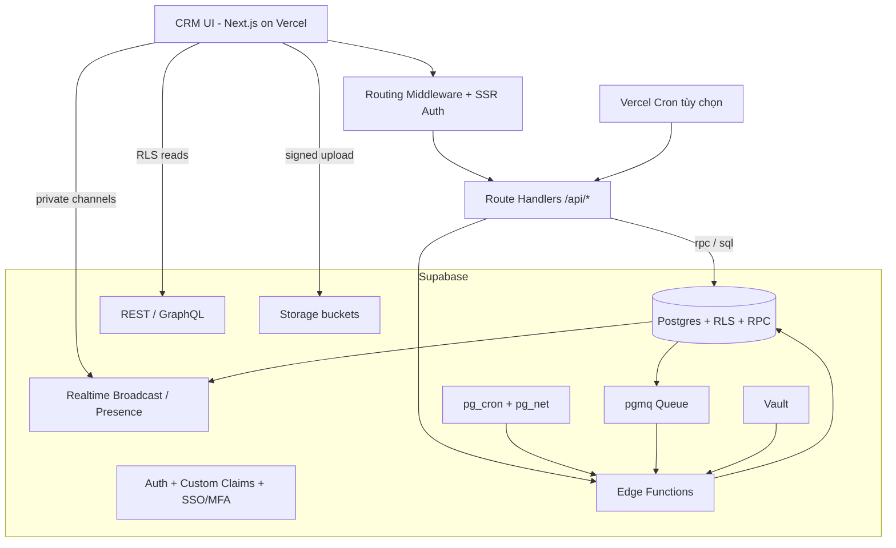
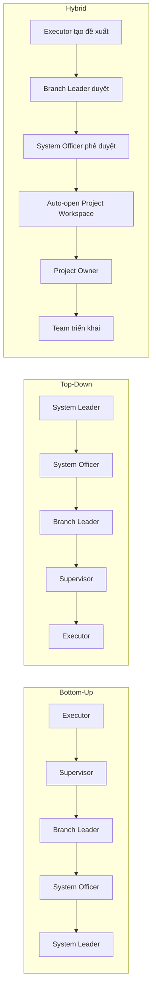
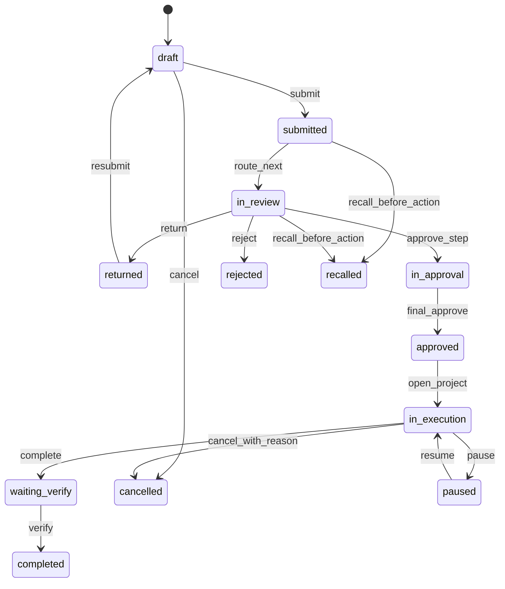
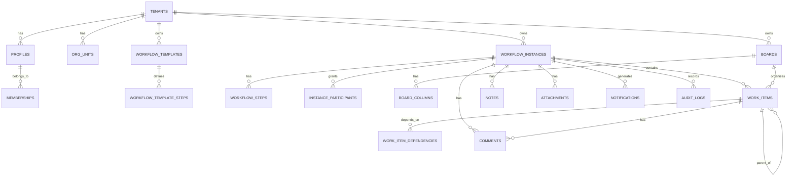

# Workflow Governance và Project Workspace cho CRM trên Vercel và Supabase

## Tóm tắt điều hành

Module này nên được triển khai như một **Work Management Engine** nằm bên trong CRM, không phải một ứng dụng quản lý dự án tách rời. Kiến trúc phù hợp nhất với bài toán của bạn là giữ nguyên **Simple Kanban** cho job nhỏ, thêm **Workflow Governance** cho các luồng nhiều cấp, và mở rộng thành **Project Workspace** khi luồng cần timeline, milestone, dependency, comment theo tiến độ, audit, bàn giao, gia hạn, nhắc hạn và phê duyệt nhiều tầng. Trên stack hiện tại, phần web nên chạy bằng **Next.js App Router trên Vercel**; phần dữ liệu, Auth, RLS, Storage, Realtime, REST/GraphQL nên dùng **Supabase**; các lệnh thay đổi trạng thái quan trọng nên đi qua **Route Handlers** hoặc **Supabase Edge Functions** rồi gọi **RPC/SQL** trong Postgres để giữ transaction, audit và idempotency nhất quán. Supabase Realtime có Broadcast, Presence và Postgres Changes; tài liệu chính thức khuyến nghị Broadcast cho khả năng mở rộng và bảo mật tốt hơn, trong khi Vercel Functions hiện không hỗ trợ đóng vai trò WebSocket server, nên realtime lõi nên đặt ở Supabase. citeturn2search7turn13search3turn13search0turn0search5turn3search0turn5search5

Với mô hình này, **Gantt không phải “engine”** mà chỉ là **một view** của cùng dữ liệu `work_items`. Cùng một dữ liệu có thể được nhìn dưới dạng Simple Kanban, Project Kanban, Gantt, Timeline, My Timeline, Audit Feed và Dashboard mà không phải nhân bản logic. Realtime nên dùng **private channels** để đồng bộ comment, thay đổi task, presence người đang xem; file nên lưu vào **Supabase Storage** với RLS và signed upload URL; các job nhắc hạn/escalation nên dùng **Supabase Cron + Edge Functions** để chạy gần database và giữ bảo mật token bằng Vault, còn Vercel Cron chỉ nên giữ cho tác vụ ứng dụng/web hoặc đồng bộ ngoài hệ thống. citeturn16search0turn15search10turn14search17turn7search3turn19search0

Về Gantt UI, nếu cần dependency/constraint/working-time nghiêm túc ngay từ đầu, lựa chọn phù hợp nhất là **DHTMLX React Gantt**; nếu đội ngũ đã tiêu chuẩn hóa Syncfusion thì **Syncfusion React Gantt** là một lựa chọn enterprise tốt; nếu cần đi nhanh với chi phí thấp cho MVP, **Frappe Gantt** phù hợp hơn. Dù chọn view nào, nên thiết kế một **Gantt Adapter** để khóa dữ liệu vào DTO nội bộ thay vì khóa vào thư viện UI. citeturn11search17turn11search2turn9search1turn9search4turn10search2turn9search2



## Mục tiêu, phạm vi và lựa chọn kiến trúc

**Mục tiêu triển khai** là tạo một module thống nhất cho ba lớp nghiệp vụ: **job nhỏ**, **luồng governance nhiều cấp**, và **project triển khai có workspace**. Từ góc nhìn người dùng, CRM chỉ thêm một lựa chọn khi tạo việc: `Simple Task` hoặc `Workflow/Project`. Từ góc nhìn kỹ thuật, hệ thống cần giữ một nguồn dữ liệu chung, cho phép bottom-up, top-down và hybrid routing, đồng thời đảm bảo mọi chuyển trạng thái quan trọng đều có audit, idempotency và quyền truy cập được kiểm soát bằng RLS. Supabase hỗ trợ mô hình này theo cả hướng **two-tier** (truy cập browser qua REST/RLS) lẫn **three-tier** (bổ sung API riêng), và GraphQL cũng được auto-reflect từ SQL schema với cùng mô hình bảo mật Postgres/RLS. Supabase Auth hỗ trợ SSR thông qua cookie khi dùng `@supabase/ssr`, còn Vercel Route Handlers và Middleware phù hợp để thực hiện lớp command/auth gate của ứng dụng. citeturn13search3turn13search0turn2search0turn2search6turn2search8

**Phạm vi giai đoạn đầu** nên bao gồm: Simple Kanban retrofit; workflow bottom-up/top-down/hybrid; template và playbook; project workspace với Kanban/Gantt/Timeline; comments và notes bám theo task/step; transfer/handoff; recall; soft cancel; notifications, escalations, audit, SSO-ready, MFA-ready và migration từ Kanban hiện hữu. **Ngoài phạm vi giai đoạn đầu**: financial planning chi tiết, resource costing sâu, document management full DMS, BI warehouse và program/portfolio management nhiều lớp. Đây là cách giảm rủi ro triển khai mà vẫn mở đường cho mở rộng sau này.

**Nguyên tắc kiến trúc** nên chốt như sau.

| Nguyên tắc | Ý nghĩa triển khai |
|---|---|
| Một nguồn dữ liệu | `work_items` là nguồn sự thật cho Kanban/Gantt/Timeline |
| Engine trước, view sau | Workflow/approval/dependency/audit là lõi; Gantt chỉ là view |
| Command/Query tách nhẹ | Thao tác stateful đi qua API/RPC; đọc dữ liệu có thể qua REST/GraphQL/RLS |
| Audit-first | Mọi action quan trọng ghi log append-only |
| Không hard delete | Chỉ `cancelled`, `archived_at`, `recalled`; không xóa vật lý artifact đã phát sinh |
| Template-driven | Mọi luồng nghiêm túc nên được sinh từ template/playbook có version |

**So sánh lựa chọn thư viện Gantt**.

| Lựa chọn | Khi nên dùng | Điểm mạnh chính | Rủi ro/giới hạn | Khuyến nghị |
|---|---|---|---|---|
| DHTMLX React Gantt | Dự án B2B có dependency, constraint, working time, resource planning nghiêm túc | Engine timeline chuyên sâu; phù hợp case enterprise | Chi phí license; cần adapter để tránh khóa cứng UI | **Khuyến nghị chính** nếu ngân sách cho phép |
| Syncfusion React Gantt | Doanh nghiệp đã dùng Syncfusion cho grid/export/UI | Hệ component enterprise mạnh; timeline + dependency + accessibility tốt | Cũng là lựa chọn commercial; gói hơi nặng nếu chỉ cần Gantt | **Khuyến nghị thay thế** nếu đã có ecosystem Syncfusion |
| Frappe Gantt | MVP, pilot, ngân sách thấp, task tree vừa phải | Open source, zero dependencies, đi nhanh | Trần tính năng enterprise thấp hơn | **Khuyến nghị MVP** hoặc fallback |

Đối chiếu trên dựa trên tài liệu chính thức của DHTMLX, Syncfusion và Frappe; phần “khuyến nghị” là đánh giá kiến trúc cho bài toán CRM B2B nhiều cấp của bạn. citeturn11search17turn11search8turn11search2turn9search1turn9search4turn10search1turn9search2turn10search2

**So sánh lựa chọn realtime**.

| Cách tiếp cận | Dùng cho | Ưu điểm | Nhược điểm | Quyết định |
|---|---|---|---|---|
| Postgres Changes | MVP, refresh list/task đơn giản | Setup nhanh, dễ hiểu | Không scale tốt bằng Broadcast | Dùng cho MVP hoặc read-sync đơn giản |
| Broadcast private channels | Comment, task updates, gantt refresh, lightweight events | Supabase khuyến nghị cho scalability/security | Phải cấu hình authorization cho `realtime.messages` | **Mặc định cho production** |
| Presence | User đang xem, online, active participants | Hợp cho trạng thái chậm thay đổi | Không dành cho high-frequency updates | Dùng kèm Broadcast |
| Custom WebSocket trên Vercel | Không nên dùng | - | Vercel Functions không hỗ trợ làm WebSocket server | **Không chọn** |

Bảng này bám theo tài liệu Realtime của Supabase và giới hạn chính thức của Vercel Functions. citeturn3search0turn3search1turn16search0turn16search6turn5search5

**So sánh mẫu auth**.

| Mẫu auth | Khi nên dùng | Ưu điểm | Lưu ý |
|---|---|---|---|
| Supabase Auth + Custom Claims + RLS | Greenfield hoặc muốn đơn giản hóa stack | Tự nhiên nhất với RLS, REST, GraphQL, Storage, Realtime | Cần thiết kế claim tối giản, quyền sâu để DB kiểm soát |
| Supabase Auth + Enterprise SSO SAML | Đơn vị B2B có IdP doanh nghiệp | Đăng nhập tập trung, phù hợp hội sở/chi nhánh | Thường cần gói enterprise/phê duyệt hạ tầng phù hợp |
| Third-party Auth với Supabase | CRM đã dùng Auth0/Clerk/WorkOS/Cognito | Giữ IdP hiện tại và vẫn dùng Data API, Storage, Realtime, Functions của Supabase | Cần chốt quy ước JWT claims và mapping role nhất quán |

Bảng này dựa trên tài liệu chính thức của Supabase về custom access token hook, SAML SSO và third-party auth. citeturn15search1turn1search1turn1search0turn8search3turn8search12

**Quyết định chốt cho tài liệu này**: dùng **Supabase Auth + Custom Claims + RLS** làm baseline; chuẩn bị cổng mở sang **SAML SSO** hoặc **third-party auth** khi khách hàng B2B yêu cầu. Về Gantt, mặc định tài liệu giả định **DHTMLX React Gantt** ở production; nếu cần đi nhanh, vẫn giữ adapter để swap sang Frappe Gantt ở pilot mà không đổi schema.

## Nghiệp vụ, vai trò và trải nghiệm người dùng

**User stories cốt lõi** của module nên được chốt ngay từ đầu để PM, BA và dev cùng nói chung một ngôn ngữ.

| Luồng | Người khởi tạo | Mô tả | Kết quả mong đợi |
|---|---|---|---|
| Simple job | Bất kỳ user | Tạo việc nhỏ, chỉ cần qua Kanban cơ bản | Tạo/move/done trong vài thao tác, không mở project workspace |
| Bottom-up proposal | Executor/cán bộ thấp nhất | Tạo luồng, chọn đích đến cuối cùng theo cấp phê duyệt | Hệ thống tự dựng route đi lên và ghi audit từng bước |
| Top-down rollout | Lãnh đạo/cán bộ hệ thống | Tạo luồng chỉ đạo đi xuống chi nhánh/đơn vị | Tạo child assignments hoặc work items theo branch/team |
| Hybrid | User thấp tạo đề xuất, cấp trên duyệt rồi mở triển khai | Luồng đi lên để duyệt, sau đó quay xuống để triển khai | Auto-open Project Workspace sau điểm phê duyệt |
| Upgrade to project | Một simple task phát triển thành nhiều work items | Chuyển task nhỏ thành project | Giữ lịch sử cũ, sinh board + gantt + timeline + playbook tasks |
| Handoff/recall | Assignee hoặc initiator theo rule | Bàn giao người xử lý hoặc thu hồi luồng | Không mất lịch sử; mọi thay đổi vào audit và notification |
| Near-deadline escalation | Hệ thống | Nhắc hạn, quá hạn, đẩy cấp trên nếu SLA bị vi phạm | Có thông báo trong app/email và escalation chain |

**Vai trò và ma trận quyền** nên tách rõ giữa vai trò tổ chức và vai trò trong dự án. Một người có thể đồng thời là `branch_leader` theo tổ chức và `advisor` trong một project cụ thể.

| Vai trò | Tạo luồng đi lên | Tạo luồng đi xuống | Thực thi task | Comment | Approve/Return | Handoff | Gia hạn | Xem audit | Quản trị template |
|---|---:|---:|---:|---:|---:|---:|---:|---:|---:|
| Executor | ✓ |  | own | ✓ |  | own | request | own |  |
| Branch Supervisor | ✓ | team | team | ✓ | team | team | team | branch |  |
| Branch Leader | ✓ | branch | branch | ✓ | branch | branch | branch | branch |  |
| System Officer L1 | ✓ | system | system | ✓ | system | system | system | system | template-use |
| System Leader L1 | ✓ | system |  | ✓ | final/system | system | system | system | template-use |
| Advisor |  |  | advisory | ✓ | advisory-optional |  | recommend | related |  |
| Project Owner |  |  | project | ✓ | project-stage | project | project | project |  |
| Auditor |  |  |  | read-only |  |  |  | cross-scope |  |
| Admin | ✓ | ✓ | ✓ | ✓ | ✓ | ✓ | ✓ | ✓ | ✓ |

**Workflow direction** nên được mô hình hóa ngay từ template.



**State machine tổng quát** không nên hard-code theo Kanban thuần. Nên dùng **action engine** để người dùng nhìn thấy “nút hành động” phù hợp vai trò thay vì chỉ nhìn cột trạng thái.



**Giao diện người dùng** nên đi theo hai lớp rõ ràng.

| Khu vực UI | Thành phần | Mục đích |
|---|---|---|
| Simple Kanban | Board, card drawer, comments mini, due badge | Job nhỏ, thao tác nhanh, ít field |
| Workflow Shell | Header, route rail, action bar, audit chip | Luồng nhiều cấp, approval-driven |
| Project Workspace | Tabs `Overview / Kanban / Gantt / Timeline / Files / Audit` | Triển khai dự án |
| Task Drawer | Assignee, reviewer, advisor, dates, dependencies, checklists | Xử lý task chi tiết |
| Comment/Timeline | Thread theo `work_item` hoặc `workflow_step` | Góp ý, nhắc việc, nhật ký |
| Action Bar | Submit, Approve, Return, Handoff, Recall, Extend, Complete | Action Engine |
| My Timeline | `Việc của tôi / chờ tôi duyệt / gần đến hạn / quá hạn` | Dashboard cá nhân |
| Transfer/Recall Modal | Chọn người nhận bàn giao, lý do, scope | Handoff/recall có kiểm soát |

**Mockup đề xuất**.

```text
[Deal: BIDV - Triển khai CRM] [Đang triển khai] [72%]
Tabs: Overview | Kanban | Gantt | Timeline | Files | Audit

┌─────────────────────┬──────────────────────────────────────┬──────────────────────────────┐
│ Route / Approval    │ Main Workspace                       │ Action + Comments            │
│                     │                                      │                              │
│ ● Draft             │ [Gantt / Kanban toggle]             │ [Approve] [Return] [Handoff]│
│ ● Branch Review     │                                      │ [Extend Due] [Recall]       │
│ ● System Approval   │ Thiết kế UI      ████               │                              │
│ ● Execution         │ Cấu hình dữ liệu    ███████         │ Task Info                    │
│ ● Verify            │ UAT                    ██            │ Assignee: Nguyễn Văn A      │
│                     │                                      │ Reviewer: Trần Văn B        │
│                     │                                      │ Comments / Timeline         │
│                     │                                      │ 09:20 A cập nhật 45%        │
│                     │                                      │ 10:10 B yêu cầu bổ sung     │
└─────────────────────┴──────────────────────────────────────┴──────────────────────────────┘
```

**Comment theo từng khung tiến độ** nên được hỗ trợ bằng `anchor` metadata, ví dụ comment có thể bám vào `gantt_bar`, `milestone`, `timeline_date` hoặc `step_id`. Realtime cho comment/task update nên dùng **Broadcast private channels**, còn Presence chỉ dùng để hiển thị ai đang xem workspace hoặc đang chỉnh sửa, vì Presence không phù hợp cho cập nhật tần suất cao. citeturn3search1turn16search0turn16search4

## Mô hình dữ liệu, workflow engine và API

**Mô hình dữ liệu khuyến nghị** là mô hình “unified work item”. Job nhỏ vẫn là `work_items`; luồng governance được đại diện bằng `workflow_instances` và `workflow_steps`; project workspace là một `workflow_instance` có `kind = project` và chứa nhiều `work_items`. Thiết kế này cho phép một simple task được “nâng cấp thành dự án” mà không đập bỏ dữ liệu cũ. Vì Supabase auto-generate REST/GraphQL theo schema, query side có thể đọc trực tiếp qua view/RLS, nhưng command side vẫn nên đi qua custom API/RPC để giữ invariant. citeturn13search3turn13search0



**Schema SQL tối thiểu** bên dưới đủ để đội dev bắt đầu dựng migration đầu tiên trên Supabase. Đây không phải toàn bộ schema cuối cùng, nhưng đã bao phủ tenant, user, org, template, instance, board, task, notes, comments, file, notification và audit.

```sql
create schema if not exists app;
create extension if not exists pgcrypto;

create type public.workflow_kind as enum
  ('simple_task','project','proposal','request','incident','program');

create type public.workflow_direction as enum
  ('bottom_up','top_down','hybrid');

create type public.instance_status as enum
  ('draft','submitted','in_review','in_approval','approved','in_execution',
   'waiting_verify','returned','recalled','rejected','completed','cancelled','paused');

create type public.work_item_type as enum ('phase','task','milestone');
create type public.progress_mode as enum ('none','manual','auto');

create table public.tenants (
  id uuid primary key default gen_random_uuid(),
  code text not null unique,
  name text not null,
  created_at timestamptz not null default now()
);

create table public.profiles (
  id uuid primary key references auth.users(id) on delete cascade,
  tenant_id uuid not null references public.tenants(id),
  full_name text not null,
  email text not null,
  avatar_url text,
  is_active boolean not null default true,
  created_at timestamptz not null default now()
);

create table public.org_units (
  id uuid primary key default gen_random_uuid(),
  tenant_id uuid not null references public.tenants(id),
  parent_id uuid references public.org_units(id),
  code text not null,
  name text not null,
  unit_type text not null,      -- branch, department, system, office...
  level_no int not null,        -- 1..N
  created_at timestamptz not null default now(),
  unique (tenant_id, code)
);

create table public.memberships (
  id uuid primary key default gen_random_uuid(),
  tenant_id uuid not null references public.tenants(id),
  user_id uuid not null references public.profiles(id) on delete cascade,
  org_unit_id uuid not null references public.org_units(id) on delete cascade,
  app_role text not null,       -- executor, branch_supervisor, branch_leader...
  title text,
  is_primary boolean not null default false,
  created_at timestamptz not null default now(),
  unique (user_id, org_unit_id, app_role)
);

create table public.workflow_templates (
  id uuid primary key default gen_random_uuid(),
  tenant_id uuid not null references public.tenants(id),
  code text not null,
  name text not null,
  kind public.workflow_kind not null,
  direction public.workflow_direction not null,
  is_active boolean not null default true,
  config jsonb not null default '{}'::jsonb,
  version int not null default 1,
  created_at timestamptz not null default now(),
  unique (tenant_id, code, version)
);

create table public.workflow_template_steps (
  id uuid primary key default gen_random_uuid(),
  template_id uuid not null references public.workflow_templates(id) on delete cascade,
  seq_no int not null,
  step_code text not null,
  step_name text not null,
  step_type text not null,      -- review, approve, execute, verify
  actor_scope_type text not null, -- user, role, org_level, org_unit
  actor_role text,
  actor_level_no int,
  sla_hours int,
  parallel_group int,
  config jsonb not null default '{}'::jsonb,
  unique (template_id, seq_no)
);

create table public.workflow_instances (
  id uuid primary key default gen_random_uuid(),
  tenant_id uuid not null references public.tenants(id),
  crm_deal_id uuid,
  customer_id uuid,
  template_id uuid references public.workflow_templates(id),
  source_work_item_id uuid,
  code text not null,
  title text not null,
  description text,
  kind public.workflow_kind not null,
  direction public.workflow_direction not null,
  status public.instance_status not null default 'draft',
  origin_user_id uuid not null references public.profiles(id),
  origin_org_unit_id uuid references public.org_units(id),
  owner_user_id uuid references public.profiles(id),
  advisor_user_id uuid references public.profiles(id),
  target_level_no int,
  start_at timestamptz,
  due_at timestamptz,
  completed_at timestamptz,
  cancelled_at timestamptz,
  payload jsonb not null default '{}'::jsonb,
  archived_at timestamptz,
  created_by uuid not null references public.profiles(id),
  updated_by uuid not null references public.profiles(id),
  created_at timestamptz not null default now(),
  updated_at timestamptz not null default now(),
  unique (tenant_id, code)
);

create table public.workflow_steps (
  id uuid primary key default gen_random_uuid(),
  instance_id uuid not null references public.workflow_instances(id) on delete cascade,
  template_step_id uuid references public.workflow_template_steps(id),
  seq_no int not null,
  step_code text not null,
  step_name text not null,
  step_type text not null,
  status text not null default 'pending',  -- pending, current, acted, skipped
  actor_scope_type text not null,
  actor_role text,
  actor_user_id uuid references public.profiles(id),
  actor_org_unit_id uuid references public.org_units(id),
  assigned_at timestamptz,
  due_at timestamptz,
  acted_at timestamptz,
  is_current boolean not null default false,
  metadata jsonb not null default '{}'::jsonb,
  unique (instance_id, seq_no)
);

create table public.instance_participants (
  instance_id uuid not null references public.workflow_instances(id) on delete cascade,
  user_id uuid not null references public.profiles(id) on delete cascade,
  access_level text not null,   -- view, comment, act, admin
  can_comment boolean not null default true,
  can_act boolean not null default false,
  source text not null,         -- initiator, step_actor, assignee, watcher...
  created_at timestamptz not null default now(),
  primary key (instance_id, user_id)
);

create table public.boards (
  id uuid primary key default gen_random_uuid(),
  tenant_id uuid not null references public.tenants(id),
  scope_type text not null,     -- simple_team, project_instance
  scope_id uuid not null,
  name text not null,
  kind text not null default 'kanban',
  created_at timestamptz not null default now()
);

create table public.board_columns (
  id uuid primary key default gen_random_uuid(),
  board_id uuid not null references public.boards(id) on delete cascade,
  code text not null,
  name text not null,
  position int not null,
  is_done boolean not null default false,
  wip_limit int,
  color text,
  unique (board_id, code)
);

create table public.work_items (
  id uuid primary key default gen_random_uuid(),
  tenant_id uuid not null references public.tenants(id),
  instance_id uuid references public.workflow_instances(id) on delete cascade,
  board_id uuid references public.boards(id),
  column_id uuid references public.board_columns(id),
  parent_id uuid references public.work_items(id),
  item_type public.work_item_type not null default 'task',
  title text not null,
  description text,
  assignee_user_id uuid references public.profiles(id),
  reviewer_user_id uuid references public.profiles(id),
  advisor_user_id uuid references public.profiles(id),
  status text not null default 'todo',
  priority text not null default 'normal',
  progress_mode public.progress_mode not null default 'manual',
  progress_pct numeric(5,2) not null default 0 check (progress_pct >= 0 and progress_pct <= 100),
  weight numeric(8,2) not null default 1,
  start_at timestamptz,
  due_at timestamptz,
  completed_at timestamptz,
  sort_order numeric(12,4) not null default 0,
  is_blocked boolean not null default false,
  blocked_reason text,
  metadata jsonb not null default '{}'::jsonb,
  archived_at timestamptz,
  created_by uuid not null references public.profiles(id),
  updated_by uuid not null references public.profiles(id),
  created_at timestamptz not null default now(),
  updated_at timestamptz not null default now()
);

create table public.work_item_dependencies (
  predecessor_id uuid not null references public.work_items(id) on delete cascade,
  successor_id uuid not null references public.work_items(id) on delete cascade,
  dependency_type text not null default 'finish_to_start',
  lag_minutes int not null default 0,
  primary key (predecessor_id, successor_id)
);

create table public.comments (
  id uuid primary key default gen_random_uuid(),
  tenant_id uuid not null references public.tenants(id),
  instance_id uuid references public.workflow_instances(id) on delete cascade,
  work_item_id uuid references public.work_items(id) on delete cascade,
  step_id uuid references public.workflow_steps(id) on delete cascade,
  parent_comment_id uuid references public.comments(id),
  kind text not null default 'comment', -- comment, decision, mention
  body text not null,
  anchor jsonb,                         -- gantt_bar, date, milestone, step...
  created_by uuid not null references public.profiles(id),
  created_at timestamptz not null default now(),
  edited_at timestamptz
);

create table public.notes (
  id uuid primary key default gen_random_uuid(),
  tenant_id uuid not null references public.tenants(id),
  instance_id uuid not null references public.workflow_instances(id) on delete cascade,
  work_item_id uuid references public.work_items(id) on delete cascade,
  kind text not null default 'note', -- note, sticky, decision
  title text,
  body text not null,
  color text,
  pinned boolean not null default false,
  position jsonb,
  created_by uuid not null references public.profiles(id),
  created_at timestamptz not null default now(),
  archived_at timestamptz
);

create table public.attachments (
  id uuid primary key default gen_random_uuid(),
  tenant_id uuid not null references public.tenants(id),
  instance_id uuid references public.workflow_instances(id) on delete cascade,
  work_item_id uuid references public.work_items(id) on delete cascade,
  step_id uuid references public.workflow_steps(id) on delete cascade,
  bucket text not null,
  object_path text not null,
  file_name text not null,
  mime_type text not null,
  size_bytes bigint not null,
  checksum text,
  uploaded_by uuid not null references public.profiles(id),
  created_at timestamptz not null default now(),
  unique (bucket, object_path)
);

create table public.notifications (
  id uuid primary key default gen_random_uuid(),
  tenant_id uuid not null references public.tenants(id),
  user_id uuid not null references public.profiles(id),
  instance_id uuid references public.workflow_instances(id) on delete cascade,
  work_item_id uuid references public.work_items(id) on delete cascade,
  channel text not null default 'in_app', -- in_app, email, webhook
  type text not null,
  title text not null,
  body text not null,
  link text,
  payload jsonb not null default '{}'::jsonb,
  status text not null default 'queued',   -- queued, sent, failed, read
  deliver_at timestamptz,
  delivered_at timestamptz,
  read_at timestamptz,
  error text,
  created_at timestamptz not null default now()
);

create table public.audit_logs (
  id bigint generated always as identity primary key,
  tenant_id uuid not null references public.tenants(id),
  instance_id uuid references public.workflow_instances(id) on delete set null,
  work_item_id uuid references public.work_items(id) on delete set null,
  step_id uuid references public.workflow_steps(id) on delete set null,
  action_code text not null,
  event_group text not null, -- workflow, task, file, note, security
  actor_user_id uuid references public.profiles(id),
  actor_org_unit_id uuid references public.org_units(id),
  from_state text,
  to_state text,
  request_id text,
  session_id uuid,
  ip inet,
  user_agent text,
  payload jsonb not null default '{}'::jsonb,
  created_at timestamptz not null default now()
);

create index idx_instances_tenant_status_due on public.workflow_instances(tenant_id, status, due_at);
create index idx_steps_instance_current on public.workflow_steps(instance_id, is_current);
create index idx_participants_user_instance on public.instance_participants(user_id, instance_id);
create index idx_work_items_instance_parent on public.work_items(instance_id, parent_id);
create index idx_work_items_assignee_due on public.work_items(assignee_user_id, due_at) where archived_at is null;
create index idx_comments_instance_created on public.comments(instance_id, created_at desc);
create index idx_audit_instance_created on public.audit_logs(instance_id, created_at desc);
```

**Template và playbook** nên có version và sinh route/task tự động. Ví dụ JSON seed cho hybrid rollout:

```json
{
  "templateCode": "crm_rollout_hybrid_v1",
  "name": "Triển khai CRM Hybrid",
  "kind": "project",
  "direction": "hybrid",
  "routing": {
    "fromPrimaryOrgUnit": true,
    "upToLevelNo": 5,
    "fanOutAfterApproval": "branch"
  },
  "actions": ["submit", "approve", "return", "reject", "handoff", "recall", "extend_due", "cancel", "complete"],
  "playbook": {
    "autoOpenProject": true,
    "tasks": [
      {"key":"survey","type":"phase","title":"Khảo sát","offsetDays":0,"durationDays":3,"role":"executor"},
      {"key":"config","type":"task","title":"Cấu hình dữ liệu","offsetDays":3,"durationDays":10,"role":"project_owner","dependsOn":["survey"]},
      {"key":"uat","type":"milestone","title":"UAT","offsetDays":14,"durationDays":1,"role":"advisor","dependsOn":["config"]}
    ]
  }
}
```

**RLS và custom claims** là bắt buộc nếu muốn an toàn từ browser tới database. Supabase khuyến nghị bật RLS trên mọi bảng ở exposed schema; `auth.uid()` sẽ trả về `null` nếu request chưa xác thực, nên policy phải explicit; khi policy phức tạp, nên dùng helper function `security definer` trong schema riêng và tránh join nặng trực tiếp trong policy. Custom role claims nên được đưa vào JWT bằng **Custom Access Token Hook**, nhưng chỉ nên đưa claim nhỏ gọn như `tenant_id`, `primary_org_unit_id`, `app_roles[]` và để quyền fine-grained nằm trong database. citeturn7search21turn15search0turn15search1turn15search9

Ví dụ helper RLS tối thiểu:

```sql
create or replace function app.has_instance_access(p_instance_id uuid)
returns boolean
language sql
security definer
stable
set search_path = public
as $$
  select exists (
    select 1
    from public.instance_participants p
    where p.instance_id = p_instance_id
      and p.user_id = auth.uid()
  );
$$;

revoke all on function app.has_instance_access(uuid) from public;
grant execute on function app.has_instance_access(uuid) to authenticated;

alter table public.workflow_instances enable row level security;
alter table public.work_items enable row level security;
alter table public.audit_logs enable row level security;

create policy "instance_select"
on public.workflow_instances
for select
to authenticated
using ((select app.has_instance_access(id)));

create policy "instance_insert_creator"
on public.workflow_instances
for insert
to authenticated
with check (created_by = auth.uid());

create policy "work_item_select"
on public.work_items
for select
to authenticated
using (
  (instance_id is not null and (select app.has_instance_access(instance_id)))
  or assignee_user_id = auth.uid()
  or reviewer_user_id = auth.uid()
);

create policy "audit_select"
on public.audit_logs
for select
to authenticated
using (
  (instance_id is not null and (select app.has_instance_access(instance_id)))
  or exists (
    select 1
    from public.memberships m
    where m.user_id = auth.uid()
      and m.app_role in ('auditor','admin')
  )
);

revoke update, delete on public.audit_logs from anon, authenticated;
```

**Storage** nên dùng bucket private với signed upload URL. Supabase Storage tích hợp với Postgres RLS và signed upload URL có thể dùng để upload browser-side mà không lộ service role; signed upload URLs có thời hạn hữu hạn. Luồng chuẩn là: browser gọi API xin signed upload URL, upload file trực tiếp lên bucket, rồi server/RPC ghi `attachments` + `audit_logs`. citeturn15search10turn4search11turn4search17

Ví dụ policy Storage tối thiểu:

```sql
-- bucket_id = 'workflow-private'
create policy "workflow private read"
on storage.objects
for select
to authenticated
using (
  bucket_id = 'workflow-private'
  and exists (
    select 1
    from public.attachments a
    where a.bucket = storage.objects.bucket_id
      and a.object_path = storage.objects.name
      and (
        (a.instance_id is not null and (select app.has_instance_access(a.instance_id)))
        or a.uploaded_by = auth.uid()
      )
  )
);
```

**Workflow Action Engine** nên được đặt trong một RPC/SQL function hoặc một lớp service bọc transaction. Command side không nên cập nhật trực tiếp bảng từ client. Tất cả action như `submit`, `approve`, `return`, `handoff`, `recall`, `extend_due`, `complete`, `cancel` phải đi qua cùng một đường xử lý để bảo đảm: validate quyền, validate dependency, cập nhật state, ghi audit, phát notification và emit realtime event.

```sql
create or replace function app.perform_workflow_action(
  p_instance_id uuid,
  p_action_code text,
  p_payload jsonb default '{}'::jsonb,
  p_request_id text default null
)
returns jsonb
language plpgsql
security definer
set search_path = public, extensions
as $$
declare
  v_actor uuid := auth.uid();
  v_instance public.workflow_instances;
begin
  if v_actor is null then
    raise exception 'unauthenticated';
  end if;

  select * into v_instance
  from public.workflow_instances
  where id = p_instance_id
  for update;

  if not exists (
    select 1 from public.instance_participants p
    where p.instance_id = p_instance_id
      and p.user_id = v_actor
      and (p.can_act = true or p.access_level = 'admin')
  ) then
    raise exception 'forbidden';
  end if;

  -- 1) validate current state + action
  -- 2) validate dependencies / SLA / template rules
  -- 3) update workflow_instances + workflow_steps + work_items
  -- 4) insert audit_logs
  -- 5) insert notifications / queue messages
  -- 6) return new state

  insert into public.audit_logs(
    tenant_id, instance_id, action_code, event_group, actor_user_id,
    request_id, payload
  )
  values (
    v_instance.tenant_id, v_instance.id, p_action_code, 'workflow',
    v_actor, coalesce(p_request_id, gen_random_uuid()::text), p_payload
  );

  return jsonb_build_object(
    'instanceId', v_instance.id,
    'actionCode', p_action_code,
    'status', 'ok'
  );
end $$;
```

**Auto-progress** nên ưu tiên tính toán tự động từ task con có trọng số thay vì cho PM gõ tay tiến độ phase/dự án. Ví dụ:

```sql
create or replace function app.recompute_parent_progress(p_parent_id uuid)
returns void
language sql
security definer
set search_path = public
as $$
  update public.work_items p
  set progress_pct = coalesce((
      select round(sum(coalesce(c.weight, 1) * c.progress_pct) / nullif(sum(coalesce(c.weight, 1)), 0), 2)
      from public.work_items c
      where c.parent_id = p_parent_id
        and c.archived_at is null
    ), 0),
    updated_at = now()
  where p.id = p_parent_id
    and p.progress_mode = 'auto';
$$;
```

**Dependency engine** nên support tối thiểu `finish_to_start` ở giai đoạn đầu. Business rule quan trọng là: nếu predecessor chưa hoàn thành thì không cho milestone/task phụ thuộc chuyển sang `doing` hoặc `completed`, trừ khi template cho override có audit và lý do.

**Thiết kế API** nên theo nguyên tắc: **Command qua custom REST**, **Query qua REST/GraphQL views**.

| Method | Path | Mục đích | Auth rule | Idempotency |
|---|---|---|---|---|
| `POST` | `/api/workflows` | Tạo workflow instance | User đăng nhập, có quyền tạo theo template | `requestId` |
| `GET` | `/api/workflows/:id` | Lấy shell + route + quyền action | RLS participant | - |
| `POST` | `/api/workflows/:id/actions` | Submit/approve/return/recall/cancel... | Participant có `can_act` | `Idempotency-Key` |
| `GET` | `/api/workspaces/:id/overview` | Tổng quan project/workflow | RLS participant | - |
| `GET` | `/api/workspaces/:id/board` | Dữ liệu Kanban | RLS participant | - |
| `GET` | `/api/workspaces/:id/gantt` | Dữ liệu Gantt đã normalize | RLS participant | - |
| `POST` | `/api/work-items` | Tạo task/phase/milestone | Quyền trong workspace | `requestId` |
| `PATCH` | `/api/work-items/:id` | Sửa metadata task | Assignee/reviewer/PM theo rule | ETag hoặc version |
| `POST` | `/api/work-items/:id/comments` | Comment / mention / pin timeline | Participant workspace | `requestId` |
| `POST` | `/api/work-items/:id/handoff` | Bàn giao người xử lý | Assignee hoặc cấp trên | `requestId` |
| `POST` | `/api/work-items/:id/attachments/sign-upload` | Xin signed upload URL | Participant workspace | - |
| `GET` | `/api/me/timeline` | Timeline cá nhân | User hiện tại | - |

Supabase cung cấp REST API auto-generated ở `/rest/v1` và GraphQL endpoint ở `/graphql/v1`; GraphQL thừa hưởng RLS như SQL schema. Vì vậy query phức tạp cho workspace có thể chuyển qua GraphQL nếu team đã dùng Apollo/Codegen, nhưng không nên dùng GraphQL cho command side của workflow. citeturn13search3turn13search0turn13search2

Ví dụ payload tạo luồng:

```json
{
  "templateCode": "crm_rollout_hybrid_v1",
  "kind": "project",
  "direction": "hybrid",
  "crmDealId": "35dc15c8-97a3-4ff0-9c18-5d0d5b9a56b8",
  "title": "Triển khai CRM BIDV Đắk Lắk",
  "description": "Khởi tạo từ deal đã ký",
  "targetLevelNo": 5,
  "ownerUserId": "c0a7189d-2664-4f9c-9d9f-5a9158b9d7ef",
  "advisorUserId": "4f69d0b5-b442-44b8-b05e-1f6cc4a2b43f",
  "playbookCode": "crm_standard_v1"
}
```

Ví dụ payload action/handoff:

```json
{
  "actionCode": "handoff",
  "payload": {
    "toUserId": "0dda2e0e-3a2e-4f0b-8f4e-f80a888edec7",
    "reason": "Người xử lý cũ nghỉ phép",
    "cascadeOpenTasks": true
  },
  "requestId": "3eb4f87b-f896-4f2f-b3d4-5b0fd262c532"
}
```

Ví dụ Route Handler rút gọn trên Vercel:

```ts
// app/api/workflows/[id]/actions/route.ts
import { NextRequest, NextResponse } from 'next/server';
import { cookies } from 'next/headers';
import { createServerClient } from '@supabase/ssr';
import { z } from 'zod';

const Body = z.object({
  actionCode: z.string().min(1),
  payload: z.record(z.any()).default({}),
  requestId: z.string().uuid().optional(),
});

export async function POST(
  req: NextRequest,
  ctx: { params: Promise<{ id: string }> }
) {
  const body = Body.parse(await req.json());
  const { id } = await ctx.params;
  const cookieStore = await cookies();

  const supabase = createServerClient(
    process.env.NEXT_PUBLIC_SUPABASE_URL!,
    process.env.NEXT_PUBLIC_SUPABASE_ANON_KEY!,
    {
      cookies: {
        getAll: () => cookieStore.getAll(),
        setAll: () => {
          // shared helper có thể set cookie tại đây nếu cần refresh session
        },
      },
    }
  );

  const { data: authData } = await supabase.auth.getUser();
  if (!authData.user) {
    return NextResponse.json({ error: 'Unauthorized' }, { status: 401 });
  }

  const { data, error } = await supabase.rpc('perform_workflow_action', {
    p_instance_id: id,
    p_action_code: body.actionCode,
    p_payload: body.payload,
    p_request_id: body.requestId ?? crypto.randomUUID(),
  });

  if (error) {
    return NextResponse.json({ error: error.message }, { status: 400 });
  }

  return NextResponse.json(data);
}
```

Ví dụ Realtime subscription cho workspace:

```ts
const channel = supabase
  .channel(`wf:${instanceId}`, { config: { private: true } })
  .on('broadcast', { event: 'comment.created' }, ({ payload }) => {
    // append thread
  })
  .on('broadcast', { event: 'work-item.updated' }, ({ payload }) => {
    // sync kanban / gantt row
  })
  .on('presence', { event: 'sync' }, () => {
    // show active viewers
  })
  .subscribe();
```

**Migration từ Kanban hiện tại** nên làm theo chiến lược “không làm vỡ UX hiện tại”. Trình tự đề xuất:

| Bước migration | Mục tiêu |
|---|---|
| Tạo schema mới | Dựng `boards`, `board_columns`, `work_items`, `workflow_*`, `audit_logs` |
| Mirror board cũ | Mỗi board/cột hiện tại map sang `boards`/`board_columns` |
| Backfill `work_items` | Chuyển card hiện tại sang `work_items` |
| Compatibility view | Tạo view trả shape cũ để frontend Kanban cũ vẫn chạy |
| Dual-write ngắn hạn | Trong 1 sprint, card mới ghi cả legacy table và `work_items` |
| Cắt frontend sang schema mới | Board cũ vẫn UX như cũ nhưng read từ schema mới |
| Bật “Upgrade to Project” | Cho phép card simple sinh `workflow_instance` + board/gantt |
| Freeze tables cũ | Chỉ giữ read-only và script rollback trong thời gian ngắn |

Outline migration scripts:

```sql
-- 001_init_work_management.sql
-- 002_seed_boards_from_legacy.sql
-- 003_backfill_work_items_from_legacy_tasks.sql
-- 004_create_compatibility_views.sql
-- 005_enable_dual_write_triggers.sql
-- 006_seed_templates_playbooks.sql
-- 007_enable_rls.sql
-- 008_cutover_frontend.sql
```

Supabase CLI phù hợp để quản lý local stack, migrations và generate TypeScript types từ schema; đây nên là pipeline chuẩn của dự án. citeturn13search5turn7search13

## Hạ tầng, bảo mật và vận hành trên Vercel và Supabase

**Topology triển khai** nên là: CRM web trên **Vercel/Next.js**; route handlers trong `app/api/*`; `middleware.ts` bảo vệ route `/crm/*`, `/workflow/*`, `/project/*`; Supabase làm Postgres/Auth/RLS/Storage/Realtime; Supabase Edge Functions cho integration/webhook/database-adjacent jobs; region của Functions nên đặt gần database để giảm roundtrip. Vercel cho phép cấu hình region cho Functions và khuyến nghị chạy gần data source; Supabase Edge Functions cũng lưu ý nếu function thao tác DB/Storage nặng thì nên chạy cùng region database thay vì chỉ “gần user”. citeturn2search7turn18search7turn18search0turn18search2turn14search11

**Biến môi trường và secrets** nên tách rõ.

| Biến | Nơi lưu | Vai trò | Ghi chú |
|---|---|---|---|
| `NEXT_PUBLIC_SUPABASE_URL` | Vercel env | Browser + server connect Supabase | public |
| `NEXT_PUBLIC_SUPABASE_ANON_KEY` | Vercel env | Browser client dùng RLS | public |
| `SUPABASE_SERVICE_ROLE_KEY` | Vercel sensitive env | Worker/admin jobs/server-only | **không bao giờ vào browser** |
| `APP_BASE_URL` | Vercel env | Link notifications/callbacks | public nội bộ |
| `CRON_SECRET` | Vercel env | Xác thực Vercel Cron | random ≥ 16 chars |
| `SMTP_*` hoặc `RESEND_API_KEY` | Vercel sensitive env | Email notification | server-only |
| `SENTRY_DSN` / OTLP endpoint | Vercel env | Observability | optional |
| Integration secrets | Supabase Vault | Token cho pg_cron → Edge Functions/webhooks | vault cho DB-side jobs |

Vercel mã hóa environment variables ở trạng thái lưu trữ và có loại **sensitive environment variables** không đọc lại được sau khi tạo; Supabase Vault phù hợp để lưu secret dùng từ phía database/cron. citeturn1search3turn1search11turn7search3

**Lịch và background work** nên tách theo mức độ quan trọng của nghiệp vụ. Với nhắc hạn, escalation, gửi email duyệt, recheck overdue hoặc fan-out rollout, nên dùng **pg_cron + Edge Functions + pgmq** ở Supabase vì nó chạy gần DB, có thể gọi function định kỳ và giữ secret trong Vault. Vercel Cron nên dùng cho việc app-side hoặc external sync nhẹ; ngoài ra, tài liệu Vercel nêu cron invocation có thể bị giao lặp nên job phải idempotent, và trên Hobby cron bị giới hạn rất chặt. Với việc “chạy sau response” không cần độ bền, có thể dùng `waitUntil()` trên Vercel hoặc background tasks ở Supabase Edge Functions; còn việc giao việc/notification cốt lõi nên đi qua queue durable. citeturn4search3turn14search17turn19search0turn19search3turn18search4turn14search2turn14search1turn14search7

**So sánh cơ chế background/durable jobs**.

| Cơ chế | Dùng cho | Độ bền | Khuyến nghị |
|---|---|---|---|
| `waitUntil()` trên Vercel | Log phụ, analytics, cache invalidate | Không phải queue durable | Chỉ cho side effects không critical |
| Supabase Edge Background Tasks | Công việc async ngắn trong function | Không phải queue durable | Hợp khi logic gần integration |
| Supabase `pgmq` | Notification/escalation/retry nội bộ | Postgres-native, có archival/replay | **Mặc định cho notification core** |
| Vercel Queues | Async pipeline serverless theo topic/consumer | Durable, at-least-once, idempotency key | Dùng nếu muốn async tập trung ở Vercel |

Bảng này bám trên tài liệu chính thức của Vercel và Supabase về `waitUntil`, Edge Function background tasks, `pgmq` và Vercel Queues. citeturn18search4turn14search2turn14search1turn14search7turn17search2turn17search3

**Rule notifications và alerts** nên được thể hiện thành rule engine đơn giản trong database, không hard-code tản mạn trong frontend.

| Sự kiện | Điều kiện | Người nhận mặc định | Channel |
|---|---|---|---|
| Near deadline | `due_at - 7d / 3d / 1d` | assignee, reviewer, owner | in-app + email |
| Overdue | `now() > due_at` | assignee, reviewer, owner | in-app + email |
| Escalation | quá hạn quá ngưỡng SLA template | supervisor/leader tiếp theo | in-app + email + webhook |
| Approval requested | step mới được assign | actor của step hiện tại | in-app + email |
| Returned / rejected | action `return` hoặc `reject` | initiator + current owner | in-app |
| Handoff | action `handoff` thành công | người mới + người cũ + owner | in-app |
| Mention/comment | mention trong `comments` | mentioned users | in-app |
| Project completed | verify thành công | owner, advisor, CRM sales | in-app + email |

**Audit và compliance** phải tách hai lớp: **application audit** và **platform audit**. Application audit là `audit_logs` append-only của chính module workflow; đây là nguồn sự thật pháp lý/nghiệp vụ cho thay đổi workflow, assignment, file, comment, recall, handoff, extend due. Platform audit gồm **Supabase Auth Audit Logs** cho event đăng nhập/xác thực và **PGAudit** nếu cần ghi nhận hoạt động DB cấp SQL. JWT access token của Supabase có `session_id`, có thể dùng để correlate action từ app về session auth khi điều tra sự cố. Vì retention của platform logs là hữu ích cho vận hành nhưng bị giới hạn theo plan/nền tảng, không nên dùng logs vận hành như nguồn audit quy định; thay vào đó hãy lưu audit ứng dụng trong Postgres, bật export/archival định kỳ và chỉ coi platform logs là lớp hỗ trợ điều tra. citeturn6search11turn6search14turn15search11turn6search2turn6search12

**Nguyên tắc audit bắt buộc** nên chốt:

| Quy tắc | Cách làm |
|---|---|
| Không hard delete instance/task có lịch sử | Chỉ `archived_at`, `cancelled`, `recalled` |
| Audit append-only | revoke `UPDATE/DELETE` trên `audit_logs` |
| Ghi actor đầy đủ | `actor_user_id`, `actor_org_unit_id`, `session_id`, `ip`, `user_agent` |
| Ghi thay đổi trạng thái | `from_state`, `to_state`, `action_code`, `payload` |
| Ghi file integrity | `checksum` cho attachment nếu compliance yêu cầu |
| Retention | ví dụ 7 năm cho `audit_logs`, theo hợp đồng cho file/comments |
| Export định kỳ | nightly/weekly dump ra kho lưu trữ tuân thủ chính sách nội bộ |

**Bảo mật** nên dùng mô hình “database-first”. RLS là lớp bắt buộc cho mọi bảng public; file vào Storage cũng đi qua RLS; private Realtime channels được kiểm soát bằng policy trên `realtime.messages`; đăng nhập có thể tăng cường bằng MFA; với khách hàng B2B có IdP riêng có thể mở SAML SSO hoặc third-party auth. Supabase nêu rõ dữ liệu được mã hóa at rest và in transit ở platform, đồng thời khuyến nghị có thể thêm mã hóa ở application layer cho dữ liệu đặc biệt nhạy cảm. Vercel cũng mã hóa env vars at rest và phục vụ deployment qua HTTPS/TLS mặc định. citeturn16search0turn15search10turn7search2turn1search0turn8search3turn7search12turn1search3turn5search6

**Khuyến nghị bảo mật triển khai** nên chốt như sau.

| Hạng mục | Khuyến nghị |
|---|---|
| RBAC | Role tổ chức + role dự án; claim chỉ lưu gọn |
| RLS | Mọi bảng public bật RLS; helper function ở schema riêng |
| Service role | Chỉ dùng ở worker/route handler/edge function trusted |
| Session handling | `@supabase/ssr` với cookies cho SSR/App Router |
| SSO/MFA | Chuẩn bị claim mapping cho SAML/MFA ngay từ đầu |
| Realtime | Chỉ private channels cho workspace/workflow |
| File access | Bucket private + signed upload/read URL |
| Encryption | Dùng platform encryption mặc định; cân nhắc app-layer encryption cho trường cực nhạy cảm |
| Cron auth | Nếu dùng Vercel Cron thì bắt buộc `CRON_SECRET` |

**Hiệu năng và scale** nên ưu tiên vào RLS, query shape và realtime. Policy nên dựa vào bảng denormalized như `instance_participants` thay vì join sâu mỗi lần; helper functions nên đặt trong schema riêng và tối ưu index theo khuyến nghị của Supabase. Với realtime production, Broadcast là lựa chọn mặc định; Presence chỉ cho slow-changing state; project lớn nên lazy-load tree/task subsets, dùng virtualization ở grid/list; route handlers hoặc functions nên chạy gần database; static metadata như templates có thể cache riêng, nhưng workspace live không nên phụ thuộc mạnh vào cache CDN. Supabase còn cung cấp Realtime Reports để theo dõi connections, lag và chi phí RLS authorization cho private channels. citeturn15search9turn3search0turn3search1turn18search2turn16search1turn6search24

**Monitoring và observability** nên dùng cả hai lớp nền tảng. Vercel có Observability, Runtime Logs, Tracing và khả năng export traces/logs/drains ra bên thứ ba; Supabase có Logs Explorer, Reports cho Database/Auth/Storage/Realtime/API và Realtime Reports. Với module này, nên đẩy `request_id` từ browser → route handler → RPC → audit_logs → notifications để có thể trace trọn đường đi của một action. citeturn6search3turn6search1turn6search0turn18search8turn6search2turn6search5turn6search24

Ví dụ `vercel.json` tối thiểu:

```json
{
  "$schema": "https://openapi.vercel.sh/vercel.json",
  "regions": ["sin1"],
  "crons": [
    {
      "path": "/api/cron/cache-sync",
      "schedule": "0 2 * * *"
    }
  ]
}
```

Ví dụ gọi Edge Function định kỳ từ Supabase Cron:

```sql
select cron.schedule(
  'workflow-escalation-15m',
  '*/15 * * * *',
  $$
  select net.http_post(
    url := 'https://<project-ref>.supabase.co/functions/v1/workflow-escalation',
    headers := jsonb_build_object(
      'Authorization', 'Bearer <stored-in-vault-or-injected-secret>',
      'Content-Type', 'application/json'
    ),
    body := '{"scope":"workflow-escalation"}'::jsonb
  );
  $$
);
```

## Lộ trình triển khai, kiểm thử và rollout

**Chiến lược triển khai** nên theo hướng “engine-first, UX-safe”. Đừng bắt đầu bằng Gantt. Bắt đầu bằng unified schema + retrofit Simple Kanban, rồi mới dựng workflow engine, sau đó mở project workspace, cuối cùng mới thêm Gantt, escalations, SSO và hardening. Đây là cách giảm rủi ro lớn nhất vì bạn có thể cut over từng mặt cắt nhỏ mà không làm vỡ CRM hiện tại.

**Kế hoạch kiểm thử** nên bao phủ cả DB, API, UI, bảo mật và tải.

| Lớp test | Mục tiêu | Công cụ khuyến nghị |
|---|---|---|
| Database unit tests | schema, constraints, trigger, RPC, RLS | `pgTAP`, SQL tests |
| API integration | route handlers, auth, idempotency, error mapping | Vitest / integration runner |
| E2E | bottom-up/top-down/hybrid, upload file, handoff, recall | Playwright |
| Load / concurrency | board move, comment burst, approval throughput | k6 hoặc công cụ tương đương |
| Security tests | cross-tenant, broken object level auth, replay request | scripted security suite |
| Migration tests | legacy data parity, dual-write parity | SQL snapshot + E2E parity |

Supabase hỗ trợ local development, migrations và database unit testing với pgTAP; đây nên là lớp kiểm thử bắt buộc cho RLS và RPC của module. citeturn15search13turn13search5

**Checklist ưu tiên triển khai và acceptance criteria**.

| Ưu tiên | Epic | Acceptance criteria chính | Sprint gợi ý |
|---|---|---|---|
| P0 | Foundation schema + auth + RLS | Tenant/org/user/template schema dựng xong; RLS pass basic tests; SSR auth đi qua cookies; không có cross-tenant leak | Sprint 0 |
| P1 | Retrofit Simple Kanban | UX board cũ không vỡ; card create/move/done hoạt động trên `work_items`; compatibility view chạy ổn | Sprint 1 |
| P2 | Workflow template + route resolver | Tạo được luồng bottom-up/top-down/hybrid; route auto-build theo org tree; chọn target level từ user thấp | Sprint 2 |
| P3 | Action Engine + audit | Submit/approve/return/reject/handoff/recall/extend/cancel có transaction và audit append-only | Sprint 3 |
| P4 | Project Workspace | Overview/Kanban/Timeline/Files/Audit chạy cùng một dữ liệu; auto-open project từ approved workflow | Sprint 4 |
| P5 | Gantt + dependency + auto-progress | Task tree hiển thị đúng; move/resize cập nhật `work_items`; dependency tối thiểu FS; progress auto aggregate | Sprint 5 |
| P6 | Notifications + escalation | Near due/overdue/approval request/handoff được enqueue, deliver và retry; cron/idempotency pass | Sprint 6 |
| P7 | SSO/MFA + hardening + observability | SSO-ready/MFA-ready; logs/traces/reports bật; audit export chạy; UAT và rollout checklist hoàn tất | Sprint 7 |

**Acceptance criteria chi tiết cho từng nhóm tính năng**.

| Tính năng | Done khi |
|---|---|
| Simple Kanban | Tạo card, kéo cột, lọc, sort, due badges, comments mini; không phát sinh regression trong luồng cơ sở hiện tại |
| Bottom-up flow | Executor tạo luồng, chọn cấp đích, route auto-generated, lãnh đạo review/approve/return được, audit đầy đủ |
| Top-down rollout | Cấp hệ thống tạo luồng, chi nhánh nhận đúng phạm vi, child assignment/task tạo đúng |
| Hybrid project | Luồng đi lên được duyệt và auto-open project workspace + playbook tasks |
| Handoff | Người xử lý bàn giao người mới có lý do; người mới nhận thông báo; audit giữ `from_user → to_user` |
| Recall | Initiator recall được khi chưa có downstream action khóa; route chuyển trạng thái đúng; audit + notify |
| Gantt sync | Kéo bar đổi thời gian; Kanban/Timeline/Audit phản ánh cùng dữ liệu trong tối đa vài giây |
| Comments anchored | Comment ghim vào task bar/milestone/date hiển thị đúng ở drawer/timeline |
| Notifications | Near due, overdue, mention, approval request, handoff, reject/return đều sinh notification đúng recipients |
| Audit immutability | User thường không thể sửa/xóa audit; mọi action chính có row audit hợp lệ |
| Security | Không user nào xem được tenant/instance không thuộc mình; signed upload không lộ secret |
| Observability | Có request_id xuyên suốt; PM/ops xem được logs cơ bản, traces, reports |

**Mốc sprint và effort ước lượng** cho một đội lean gồm 1 full-stack lead, 1 frontend, 1 backend/data và 1 QA/PM chia sẻ.

| Sprint | Mục tiêu | Effort tương đối |
|---|---|---|
| Sprint 0 | Discovery cuối, schema, auth setup, CI/CD, migrations nền | 1 tuần |
| Sprint 1 | Retrofit Simple Kanban trên `work_items` | 2 tuần |
| Sprint 2 | Template, org routing, create workflow bottom-up/top-down | 2 tuần |
| Sprint 3 | Action engine, audit, handoff, recall, return/reject | 2 tuần |
| Sprint 4 | Project Workspace tabs + files/comments/notes/timeline | 2 tuần |
| Sprint 5 | Gantt adapter + dependency + auto-progress | 2 tuần |
| Sprint 6 | Notifications, cron, escalation, queue workers | 2 tuần |
| Sprint 7 | SSO/MFA-ready, performance, observability, UAT, training | 2 tuần |

**Rollout checklist** cho PM và vận hành.

| Nhóm | Checklist |
|---|---|
| Product/PM | Chốt template đầu tiên; chốt SLA escalation; mapping role nghiệp vụ ↔ app_role |
| Data/Infra | Chốt tenant model; region alignment; bucket policy; cron/queue strategy |
| Security | Review RLS, service role usage, SSO/MFA plan, audit retention |
| QA | Có test pack cho bottom-up/top-down/hybrid; migration parity checklist |
| Training | Tài liệu cho executor, supervisor, branch leader, system officer, auditor |
| Rollout | Pilot 1 chi nhánh → 1 cụm chi nhánh → hệ thống; bật feature flag theo board/template |

**Bộ thư viện khuyến nghị** để triển khai nhanh trên frontend/backend.

| Nhóm | Khuyến nghị |
|---|---|
| App web | Next.js App Router |
| Supabase client | `@supabase/supabase-js`, `@supabase/ssr` |
| Data fetching | `@tanstack/react-query` |
| Forms/validation | `react-hook-form`, `zod` |
| Drag/drop | `@dnd-kit/core`, `@dnd-kit/sortable` |
| Gantt | `@dhx/react-gantt` hoặc adapter tương đương; fallback Frappe Gantt cho MVP |
| Editor notes/comments | Tiptap hoặc editor markdown nhẹ |
| Dates | `date-fns` hoặc `dayjs` |
| E2E | Playwright |
| Testing DB | pgTAP |
| Error monitoring | Sentry hoặc OTLP-compatible stack |

**Supabase features nên bật sử dụng ngay**: RLS, Realtime Broadcast + Presence private channels, Storage private buckets + signed uploads, REST API, GraphQL optional cho read models, Edge Functions, pg_cron, pgmq, Vault, Logs Explorer, Reports, Auth hooks, MFA, SSO-ready. **Vercel features nên dùng**: Route Handlers, Middleware, sensitive env vars, region config, Runtime Logs, Observability, Tracing, Vercel Cron cho app-side jobs tuỳ chọn, Drains nếu cần lưu log dài hạn. citeturn0search5turn16search0turn15search10turn13search3turn13search0turn0search2turn14search17turn14search1turn7search3turn6search3turn2search7turn2search8turn1search11turn18search0turn6search1turn6search0

**Quyết định cuối cùng để bắt đầu build** là:

| Quyết định | Chốt triển khai |
|---|---|
| Data core | `work_items` + `workflow_instances` + `workflow_steps` + `audit_logs` |
| Command path | Vercel Route Handlers → Supabase RPC |
| Query path | Supabase REST/GraphQL + views + RLS |
| Realtime | Supabase Broadcast private channels + Presence |
| Files | Supabase Storage private buckets + signed upload URLs |
| Background jobs | Supabase pg_cron + Edge Functions + pgmq |
| Auth | Supabase Auth + custom claims; SAML/third-party auth ready |
| Gantt | DHTMLX React Gantt ở production; adapter hóa để thay được |
| Migration | Retrofit Kanban trước, project workspace sau |
| Audit | Append-only app audit + optional PGAudit/Auth audit logs |

Tài liệu này đủ để đội PM/BA/Dev bắt đầu: dựng migrations, seed template/playbook đầu tiên, retrofit Simple Kanban, xây action engine và mở project workspace theo từng sprint trên stack **Vercel + Supabase**.